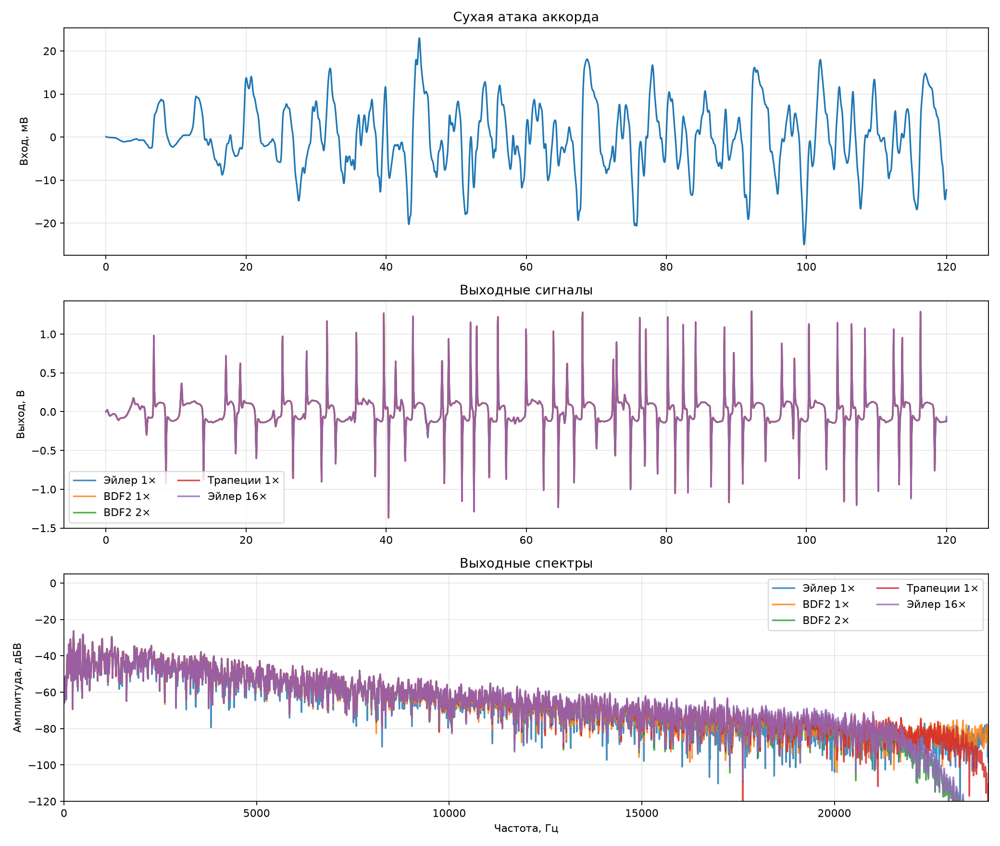

# BDF2 на гитарном аккорде

Первые 120 мс сухого ми-мажорного аккорда
`E2–B2–E3–G♯3–B3–E4` приведены к 25 мВ (пик).
Ручки длительности и тембра установлены в 1, громкость — в 0,8. Контроль — полная модель с
Эйлером при шестнадцатикратной частоте.

| Способ | Выход, В (пик) | Ошибка формы, % | Ошибка модуля спектра, дБ | Время расчёта, с | Прослушивание |
|:---|---:|---:|---:|---:|:---|
| Эйлер 1× | 1.203422 | 12.5610 | -20.86 | 3.7 | [euler_1x.wav](euler_1x.wav) |
| BDF2 1× | 1.322679 | 3.6947 | -31.65 | 3.8 | [bdf2_1x.wav](bdf2_1x.wav) |
| BDF2 2× | 1.366026 | 1.6366 | -41.52 | 7.0 | [bdf2_2x.wav](bdf2_2x.wav) |
| Трапеции 1× | 1.368455 | 2.1835 | -39.48 | 3.7 | [trapezoid_1x.wav](trapezoid_1x.wav) |
| Эйлер 16× | 1.359575 | 0.0000 | -300.00 | 49.0 | [euler_16x.wav](euler_16x.wav) |

Все обработанные варианты записаны с одним масштабом громкости. Отрезок повторён
восемь раз с паузой 180 мс. Сухой вход записан отдельно:
[сухой аккорд](dry_chord_25mv.wav).

