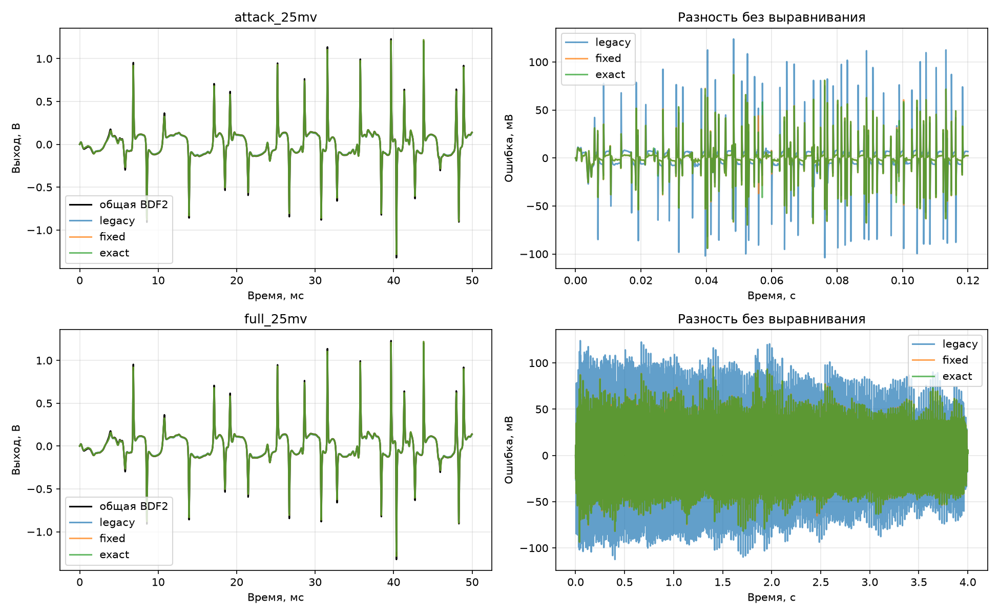

# Общая и составная BDF2 при одинаковом шаге

## Условия

48 кГц, BDF2 1×, Sustain=1, Tone=1, Volume=0,8. Во всех моделях одна гибридная
физика: нелинейные прямые переходы Q4/Q3, обе диодные пары, линеаризованный
прямой переход Q2, постоянные обратные токи Q4/Q3/Q2, оба перехода Q1.
Параметры полупроводников совпадают. Генератор C поглощает линейные токи в матрицы.
Общая система сохраняет все связи; составная использует предсказанную базу Q2
и постоянный эквивалент Нортона нагрузки Tone. Эти приближения не маскируются.

Вход нормируется один раз, затем округляется до float32 и передаётся обеим моделям.
Начальные истории равны DC, первый отсчёт уже считается BDF2, как в C.
Обычный simulate_complete начинает с Эйлера; здесь его _step вызван отдельно,
чтобы исключить различие запуска. Исходная модель и прошивка не изменялись.

Общая модель: Python float64, общий Ньютон до 30 поправок, целевая невязка 1e-12 В.
Если обычный Ньютон не сходится, ТОТ ЖЕ шаг повторяется от прежней точки
с демпфированием (до 100 поправок и 24 делений шага пополам). Уравнения,
история и частота не меняются. Первый отказ исходного Ньютона и число повторов
показаны отдельно. Контроль принимается только по конечной невязке.
Контроль отвергается при невязке >1e-8 В, нечисловом результате или |узел|>12 В.
Это не гарантированно сходящийся решатель: неуспех не доказывает отсутствие
физического решения и не превращается в численную оценку ошибки.

Составные варианты: реальное C-ядро, GCC -O3, float32 на компьютере:

- legacy — рабочий вариант с прежним полиномом Q2;
- fixed — согласованный полином Q2;
- exact — защищённый Ньютон Q2 на каждом отсчёте. Остальные блоки сохраняют
  рабочее число поправок и обновление сохранённых нелинейностей.

Разница общей модели и exact включает разбиение, ограниченное число поправок,
обновление нелинейностей и float32. Это не чистая оценка только межблочной связи.
Никакой подгонки задержки, усиления или DC для временной ошибки нет.
Относительная СКО нормирована на СКО переменной части общей модели;
спектральная ошибка вычисляется после удаления DC с окном Ханна.

## Ошибка относительно общей BDF2

| Сигнал | C-вариант | СКО, мВ | СКО, % | Пик ошибки, мВ | Спектр, дБ |
|:---|:---|---:|---:|---:|---:|
| attack_25mv | legacy | 19.03275 | 8.32690 | 123.94829 | -25.34978 |
| attack_25mv | fixed | 12.13086 | 5.30730 | 94.08865 | -32.26662 |
| attack_25mv | exact | 12.17344 | 5.32592 | 94.10463 | -32.12144 |
| attack_50mv | legacy | 20.82491 | 8.27733 | 140.26634 | -25.63646 |
| attack_50mv | fixed | 13.80776 | 5.48821 | 156.63091 | -32.63648 |
| attack_50mv | exact | 13.81227 | 5.49000 | 156.48524 | -32.63782 |
| attack_100mv | legacy | 23.89277 | 8.82537 | 240.93012 | -24.15590 |
| attack_100mv | fixed | 18.65680 | 6.89134 | 250.64043 | -26.62635 |
| attack_100mv | exact | 18.66997 | 6.89620 | 250.58273 | -26.61607 |
| attack_200mv | legacy | — | — | — | — |
| attack_200mv | fixed | — | — | — | — |
| attack_200mv | exact | — | — | — | — |
| sine_440_25mv | legacy | 25.87808 | 8.32173 | 104.20686 | -26.76913 |
| sine_440_25mv | fixed | 17.65615 | 5.67777 | 91.10366 | -38.74119 |
| sine_440_25mv | exact | 17.66613 | 5.68098 | 91.05789 | -38.75062 |
| sine_1000_25mv | legacy | 43.93892 | 8.43448 | 155.29649 | -26.42091 |
| sine_1000_25mv | fixed | 32.53537 | 6.24546 | 167.08407 | -34.41534 |
| sine_1000_25mv | exact | 32.53265 | 6.24494 | 167.07787 | -34.41222 |
| sine_3000_25mv | legacy | 102.91833 | 11.44330 | 241.24054 | -27.45941 |
| sine_3000_25mv | fixed | 89.94275 | 10.00057 | 241.50259 | -34.62077 |
| sine_3000_25mv | exact | 89.93713 | 9.99994 | 241.35927 | -34.62181 |
| sine_6000_25mv | legacy | 38.66827 | 5.19873 | 95.56038 | -32.63441 |
| sine_6000_25mv | fixed | 13.16677 | 1.77020 | 90.68687 | -46.27014 |
| sine_6000_25mv | exact | 13.15279 | 1.76832 | 90.92958 | -46.26697 |
| full_25mv | legacy | 16.74034 | 9.65013 | 124.01303 | -22.63711 |
| full_25mv | fixed | 11.44866 | 6.59969 | 96.30802 | -26.88455 |
| full_25mv | exact | 11.44815 | 6.59939 | 95.40942 | -26.88488 |
| full_100mv | legacy | 18.81763 | 8.59068 | 240.85826 | -24.59916 |
| full_100mv | fixed | 12.52090 | 5.71608 | 250.67228 | -30.91754 |
| full_100mv | exact | 12.51510 | 5.71343 | 250.64915 | -30.91566 |

Прочерк означает, что хотя бы одна сторона не прошла весь сигнал. Метрики
успешного префикса не выдаются за результат полного опыта.

## Сходимость и устойчивость

Номер плохого отсчёта — с единицы; 0 означает отсутствие отказа.

| Сигнал | Общая: отсчёт отказа | Причина | Макс. невязка, В | Первый отказ обычного Ньютона | Повторов с демпфированием | C legacy | C fixed | C exact |
|:---|---:|:---|---:|---:|---:|---:|---:|---:|
| attack_25mv | 0 | — | 9.999e-13 | 0 | 0 | 0 | 0 | 0 |
| attack_50mv | 0 | — | 9.999e-13 | 0 | 0 | 0 | 0 | 0 |
| attack_100mv | 0 | — | 9.981e-13 | 1936 | 2 | 0 | 0 | 0 |
| attack_200mv | 0 | — | 9.996e-13 | 1935 | 9 | 2107 | 2107 | 2107 |
| sine_440_25mv | 0 | — | 9.963e-13 | 0 | 0 | 0 | 0 | 0 |
| sine_1000_25mv | 0 | — | 9.812e-13 | 80 | 1 | 0 | 0 | 0 |
| sine_3000_25mv | 0 | — | 9.701e-13 | 0 | 0 | 0 | 0 | 0 |
| sine_6000_25mv | 0 | — | 9.138e-13 | 0 | 0 | 0 | 0 | 0 |
| full_25mv | 0 | — | 9.999e-13 | 0 | 0 | 0 | 0 | 0 |
| full_100mv | 0 | — | 1.000e-12 | 1936 | 3 | 0 | 0 | 0 |

## Собственный вклад Q2 относительно exact

Остальной C-код совпадает. Без выравнивания и нормировки усиления.

| Сигнал | Вариант | СКО, мВ |
|:---|:---|---:|
| attack_25mv | legacy | 9.419735 |
| attack_25mv | fixed | 0.779468 |
| attack_50mv | legacy | 10.099024 |
| attack_50mv | fixed | 0.091629 |
| attack_100mv | legacy | 10.540726 |
| attack_100mv | fixed | 0.050580 |
| sine_440_25mv | legacy | 12.092608 |
| sine_440_25mv | fixed | 0.045154 |
| sine_1000_25mv | legacy | 19.381482 |
| sine_1000_25mv | fixed | 0.039199 |
| sine_3000_25mv | legacy | 33.244561 |
| sine_3000_25mv | fixed | 0.045668 |
| sine_6000_25mv | legacy | 31.500686 |
| sine_6000_25mv | fixed | 0.122264 |
| full_25mv | legacy | 7.328529 |
| full_25mv | fixed | 0.269655 |
| full_100mv | legacy | 8.978844 |
| full_100mv | fixed | 0.409393 |

Воспроизведение: `python simulation/run_bdf2_same_step.py` (GCC в PATH).
Исходные массивы, статусы и хэши: `simulation/raw/bdf2_same_step/`.
Скрипт сохраняет отчёт перед ненулевым завершением при любом отказе.
Новые такты STM32 не измерялись.

## Итог сравнения при одинаковом BDF2

Полный аккорд 25 мВ: СКО рабочего C-ядра относительно общей гибридной BDF2
9,650%, исправленного полинома 6,600%, точного Q2 6,599%.
Полный аккорд 100 мВ: соответственно 8,591%, 5,716% и 5,713%.
Подгонка задержки, усиления и DC не применялась.

Следовательно, согласованный полином действительно приближает составное ядро
к общей модели при том же интеграторе. Ухудшение относительно ngspice из
предыдущего опыта остаётся отдельным результатом: эталоны не взаимозаменяемы.
Остаточные 5,7–6,6% нельзя целиком приписать разбиению: здесь вместе действуют
границы блоков, ограниченное число поправок, обновление нелинейностей,
обнуление малых коэффициентов и float32.

Важное уточнение прежнего вывода о срывах BDF2: общая модель прошла полный
аккорд 100 мВ с тремя демпфированными повторами того же шага и максимальной
невязкой около 1e-12 В. Атаки 100/200 мВ потребовали 2/9 повторов. Это
подтверждает проблему сходимости обычного Ньютона на этих сигналах, а не
неизбежную неустойчивость самого BDF2. Устойчивость за пределами проверок
не доказана. На атаке 200 мВ все три составных C-варианта всё ещё срываются
на отсчёте 2107, тогда как общая модель с демпфированием проходит весь отрезок.

Рабочая прошивка не менялась. Исправленный полином остаётся экспериментальным;
новых измерений тактов и прошивки платы не выполнялось.
