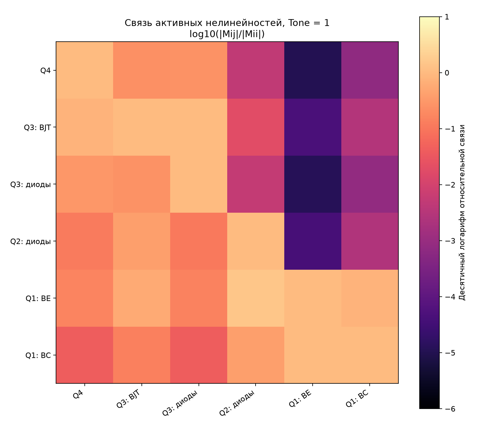
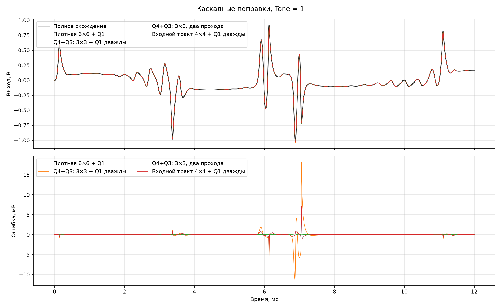

# Каскадное решение шести нелинейностей

Проверены последовательные местные поправки нескольких размеров. После каждого блока токи
и невязка пересчитываются, поэтому следующий блок использует уже исправленное состояние
предыдущего. Раздельный вариант `Q4 (1×1) → Q3 (2×2) → Q2 (1×1) → Q1 (2×2)` включён
как отрицательная проверка: сильная взаимная связь Q4 и Q3 не позволяет разделять их.

| Tone | Метод | Ошибка, мВ СКО | Пик, мВ | Максимальная невязка, В | Время Python, с |
|---:|---|---:|---:|---:|---:|
| 0.00 | Плотная 6×6 + Q1 | 5.995e-02 | 3.628e-01 | 4.203e-03 | 2.481 |
| 0.00 | Раздельные блоки, один проход | 6.224e+26 | 1.129e+27 | 6.780e+29 | 3.956 |
| 0.00 | Раздельные блоки, два прохода | 1.651e+01 | 1.282e+02 | 4.712e-04 | 6.945 |
| 0.00 | Q4+Q3: 3×3, один проход | 6.449e-01 | 5.482e+00 | 4.016e-03 | 3.179 |
| 0.00 | Q4+Q3: 3×3 + Q1 дважды | 6.433e-01 | 5.469e+00 | 4.016e-03 | 4.031 |
| 0.00 | Q4+Q3: 3×3, два прохода | 4.963e-03 | 3.870e-02 | 3.936e-05 | 5.306 |
| 0.00 | Входной тракт 4×4 + Q1 2×2 | 6.077e-02 | 3.614e-01 | 4.203e-03 | 2.655 |
| 0.00 | Входной тракт 4×4 + Q1 дважды | 5.995e-02 | 3.628e-01 | 4.203e-03 | 3.105 |
| 0.50 | Плотная 6×6 + Q1 | 1.061e-01 | 2.810e+00 | 4.271e-03 | 2.423 |
| 0.50 | Раздельные блоки, один проход | 6.785e+26 | 1.129e+27 | 8.012e+29 | 3.654 |
| 0.50 | Раздельные блоки, два прохода | 1.074e+01 | 1.173e+02 | 4.731e-04 | 6.294 |
| 0.50 | Q4+Q3: 3×3, один проход | 5.090e-01 | 5.250e+00 | 4.089e-03 | 3.128 |
| 0.50 | Q4+Q3: 3×3 + Q1 дважды | 5.010e-01 | 5.198e+00 | 4.089e-03 | 4.032 |
| 0.50 | Q4+Q3: 3×3, два прохода | 3.742e-03 | 5.147e-02 | 4.073e-05 | 4.756 |
| 0.50 | Входной тракт 4×4 + Q1 2×2 | 1.069e-01 | 2.738e+00 | 4.271e-03 | 2.463 |
| 0.50 | Входной тракт 4×4 + Q1 дважды | 1.060e-01 | 2.809e+00 | 4.271e-03 | 2.821 |
| 1.00 | Плотная 6×6 + Q1 | 2.701e-01 | 7.136e+00 | 4.180e-03 | 2.180 |
| 1.00 | Раздельные блоки, один проход | 6.785e+26 | 1.129e+27 | 1.882e+30 | 3.425 |
| 1.00 | Раздельные блоки, два прохода | 2.218e+01 | 2.559e+02 | 4.776e-04 | 5.814 |
| 1.00 | Q4+Q3: 3×3, один проход | 5.940e+26 | 1.129e+27 | 5.962e+29 | 3.150 |
| 1.00 | Q4+Q3: 3×3 + Q1 дважды | 1.159e+00 | 1.821e+01 | 3.991e-03 | 4.479 |
| 1.00 | Q4+Q3: 3×3, два прохода | 8.788e-03 | 1.188e-01 | 3.896e-05 | 5.400 |
| 1.00 | Входной тракт 4×4 + Q1 2×2 | 5.938e+26 | 1.129e+27 | 5.960e+29 | 2.445 |
| 1.00 | Входной тракт 4×4 + Q1 дважды | 2.696e-01 | 7.094e+00 | 4.181e-03 | 3.126 |

Выбраны два кандидата для переноса на STM32:

1. Дешёвый: `Q4+Q3 (3×3) → Q2 (1×1) → Q1 (2×2) → Q1 (2×2)`. Он устойчив во всём
   диапазоне Tone и даёт 0,501–1,159 мВ СКО на проверенных положениях.
2. Надёжный: `Q4+Q3+Q2 (4×4) → Q1 (2×2) → Q1 (2×2)`. Его ошибка 0,060–0,270 мВ СКО,
   то есть практически совпадает с плотной поправкой `6×6`.

Два полных прохода с блоком `Q4+Q3 (3×3)` дают всего 0,004–0,009 мВ СКО, но требуют
повторного расчёта всех каскадов и сохраняются как запасной точный вариант.

Время Python приведено только как проверка программы: короткие вызовы NumPy и повторный расчёт
нелинейных функций искажают соотношение с STM32. Для контроллера существенна структура:
следующий выбор между блоками `3×3` и `4×4` должен делаться по тактам STM32, а не по времени Python.

## Уточнение аппаратного бюджета от 2026-08-26

Повторный замер `full_pedal_cheap` дал прежние 3715 тактов в среднем и 4521 в максимуме. Эти числа относятся к
одному шагу 384 кГц с бюджетом 442 такта, а не к внешнему отсчёту 48 кГц. Поэтому каскадный вариант превышает
собственный бюджет примерно в 8,4 раза. Отделение Q2 уменьшает входную поправку лишь с 917 до 837 тактов и не меняет
архитектурный вывод: разбиение не обеспечивает реального времени.
