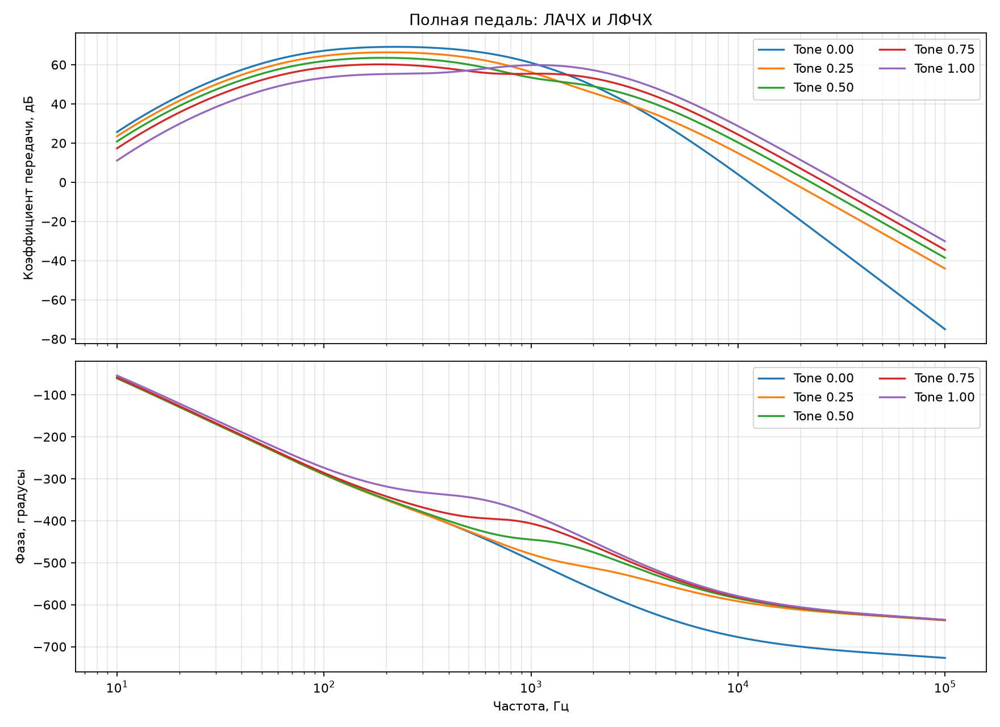
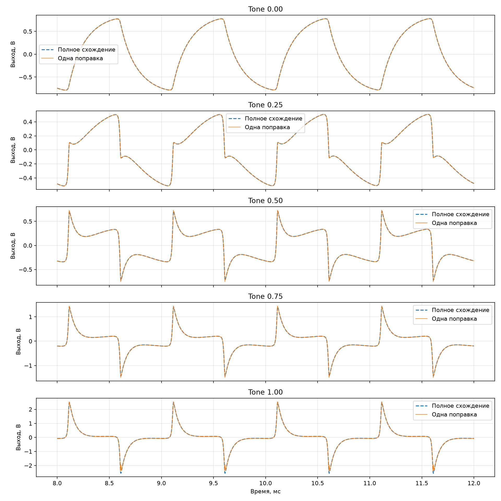

# Полная цепь до выхода

В единую систему добавлены полный темброблок, C3, выходной Q1, C2, Volume и нагрузка 1 МОм.
Получилось 25 узлов, 13 напряжений конденсаторов и 12 нелинейных переменных. Sustain и Volume
установлены в максимум, вход — синус 100 мВ пик, 1 кГц, частота расчёта 8×.

Рабочая точка Q1: база 1,636 В, эмиттер 1,012 В, коллектор 4,413 В.

| Tone | Спектральный радиус | Выход, В пик-пик | Ошибка одной поправки, мВ СКО | Пиковая ошибка, мВ | Невязка, В | Поправка, В |
|---:|---:|---:|---:|---:|---:|---:|
| 0.00 | 0.999999795 | 1.571 | 0.219 | 2.019 | 8.208e-02 | 1.534e-01 |
| 0.25 | 0.999999795 | 1.024 | 1.949 | 23.867 | 8.226e-02 | 1.534e-01 |
| 0.50 | 0.999999795 | 1.488 | 3.562 | 43.888 | 8.236e-02 | 2.303e-01 |
| 0.75 | 0.999999795 | 2.939 | 5.595 | 70.225 | 8.241e-02 | 3.537e-01 |
| 1.00 | 0.999999795 | 4.956 | 38.981 | 607.193 | 7.372e-01 | 5.653e-01 |

## Вывод

Полная система локально устойчива во всём диапазоне Tone. До Tone = 0,75 одна поправка остаётся
приемлемой. При Tone = 1 выходной Q1 получает наиболее богатый высокими частотами сигнал и сам
становится существенной нелинейностью: ошибка резко возрастает. Перед переносом полной цепи на
STM32 надо сравнить три варианта: вторая поправка только для Q1, линеаризация Q1 около рабочей
точки и ограничение рабочего диапазона входа. Физику Q1 пока не сокращаем.
