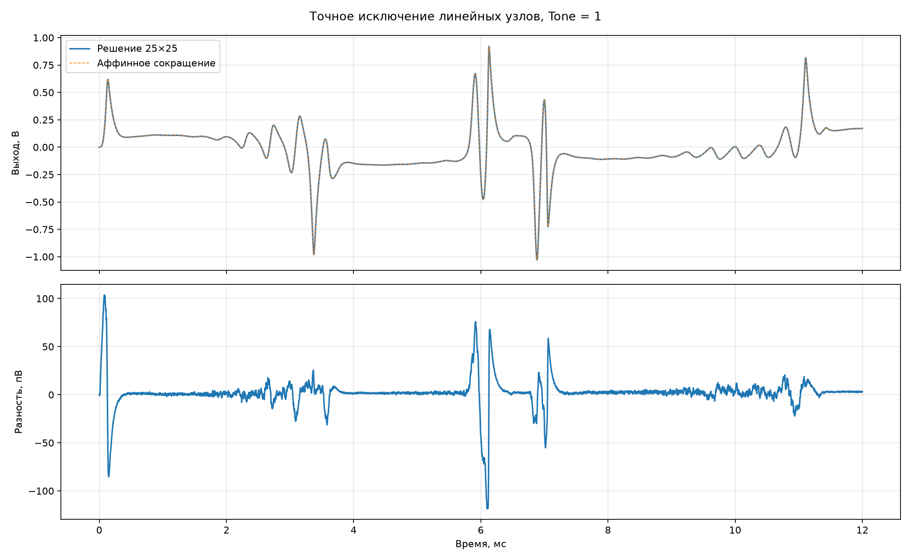

# Точное исключение линейных узлов

В исходном шаге дважды решалась линейная система `25×25`: для предиктора
нелинейных напряжений и для восстановления узлов. Обе операции точно заменены
аффинными матричными произведениями. Обращение матрицы выполняется один раз при
подготовке коэффициентов, а не на звуковом шаге.

| Sustain | Tone | Макс. по узлам, пВ | Макс. по нелин. переменным, пВ | Выход, пВ СКО | 25×25, с | Сокращение, с | Ускорение |
|---:|---:|---:|---:|---:|---:|---:|---:|
| 0.25 | 0.50 | 51.833 | 56.310 | 7.893 | 2.515 | 2.340 | 1.07 |
| 1.00 | 0.00 | 437.449 | 451.481 | 32.786 | 2.545 | 2.572 | 0.99 |
| 1.00 | 0.50 | 218.358 | 245.881 | 17.653 | 2.526 | 2.546 | 0.99 |
| 1.00 | 1.00 | 152.216 | 192.318 | 15.730 | 2.606 | 2.415 | 1.08 |

Для минимального шага, который обновляет 13 напряжений состояния, 12 нелинейных
предикторов и один выход, нужно `702` коэффициента, то есть
`2808` байт в `float32`. Полные 25 узлов на STM32 восстанавливать не нужно.

Это точное алгебраическое сокращение, а не упрощение физики. Следующий шаг — сократить
нелинейную систему `12×12` по уже выбранной физике Q3/Q2/Q1 и перенести полученный шаг в C.
