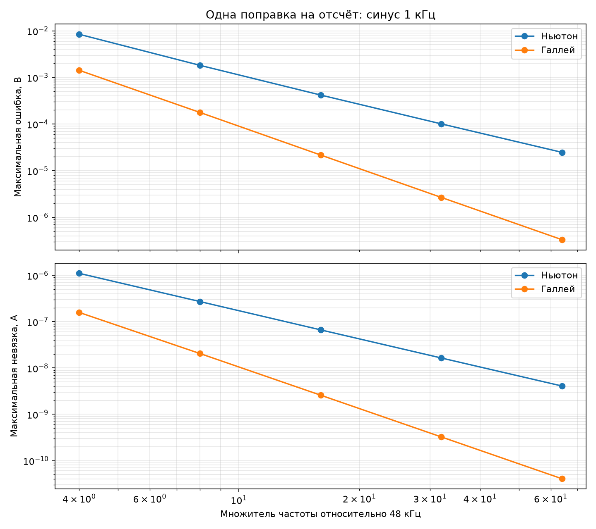
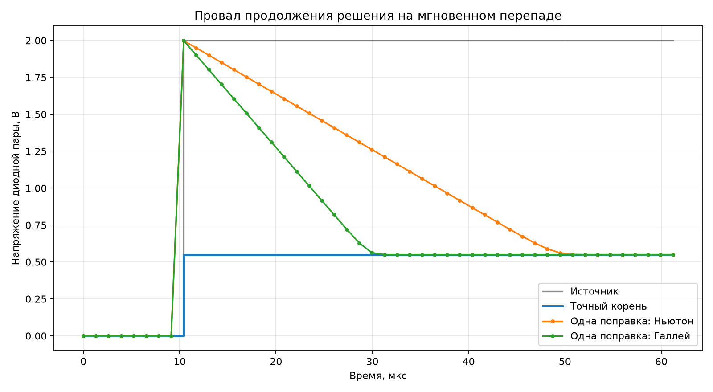

# Одна поправка Ньютона и Галлея

Условная скалярная модель проверяет продолжение корня уравнения эквивалента
Тевенина со встречно-параллельной диодной парой. Параметры не являются
утверждённой моделью 1N914.

## Гладкий вход

На синусе 1 кГц ошибка обоих методов уменьшается с ростом внутренней частоты.
Галлей в этом опыте даёт более быстрый спад ошибки, но его стоимость на CORDIC
ещё не измерена.

## Мгновенный перепад

При скачке 0 → 2 В оба метода сначала попадают почти в напряжение источника,
после чего возвращаются к корню серией последующих поправок. Это подтверждает
необходимость контроля невязки, ограничения шага и запасного надёжного метода.
