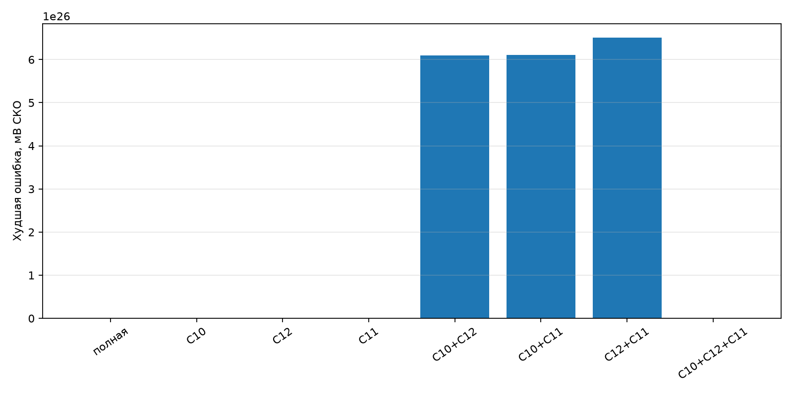

# Удаление малых ёмкостей быстрого ядра

Проверены C10, C12 и C11 по 470 пФ — межколлекторно-базовые ёмкости Q4, Q3 и Q2.
Все четыре активных нелинейных порта сохранены. Эталон и кандидаты рассчитаны двумя
полными поправками (`full_repeat`) на каждом шаге 4×; медленная часть работает 2×.
Вход — 20 мс атаки ми-мажорного аккорда, 25–200 мВ, Sustain = Tone = 1.
Первые 3 мс исключены из оценки.

| Удалено | Состояний | Худшее СКО, мВ | Худший пик, мВ | Выше 10 кГц, мВ СКО | Линейных произведений | Устойчиво |
|---|---:|---:|---:|---:|---:|---|
| полная | 9 | 0.000 | 0.000 | 0.000 | 118 | да |
| C10 | 8 | 220.630 | 1460.743 | 28.476 | 95 | да |
| C12 | 8 | 1685.255 | 3905.548 | 33.218 | 95 | да |
| C11 | 8 | 1684.525 | 3905.278 | 62.759 | 100 | да |
| C10+C12 | 7 | 610156978972201775798419456.000 | 1126666521393307442592350208.000 | 18698666434126692325785600.000 | 74 | да |
| C10+C11 | 7 | 610850348087954065300914176.000 | 1127742497485470345358999552.000 | 18739220896616806518620160.000 | 80 | да |
| C12+C11 | 7 | 651009437572778170096025600.000 | 6766454984439170329972047872.000 | 166099645754233089796603904.000 | 79 | да |
| C10+C12+C11 | 6 | 1685.534 | 3691.862 | 39.276 | 60 | да |

Число произведений — статическая оценка с порогом `1e-7`, не аппаратный замер.
Удаление ёмкости устраняет накопитель энергии и потому является изменением физики.

## Вывод

Путь закрыт. Даже самое мягкое удаление C10 даёт 220,630 мВ СКО и 1,461 В
пиковой ошибки; удаление C12 или C11 даёт около 1,685 В СКО. Сочетания двух
ёмкостей приводят к практической потере устойчивости. Потенциальное сокращение
разреженной линейной части с 118 до 95–100 произведений не оправдывает потерю
высокочастотной обратной связи. На STM32 этот вариант не переносится.
