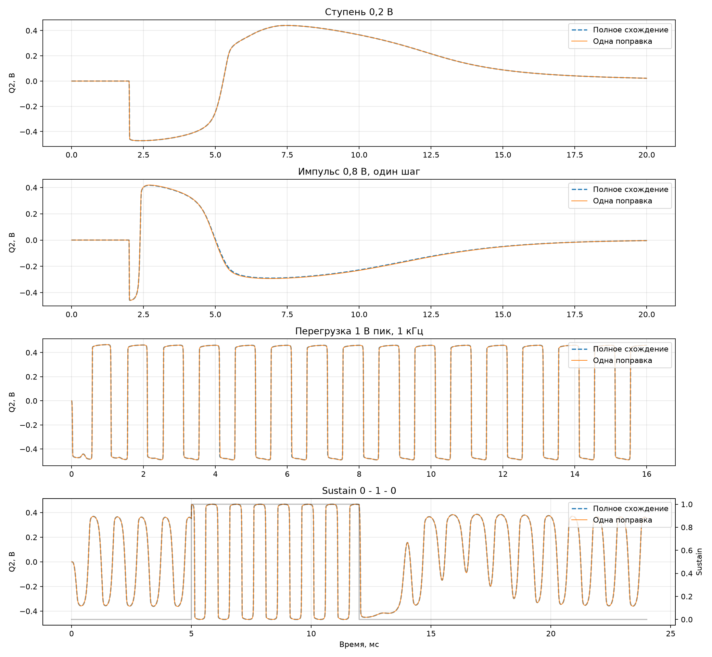
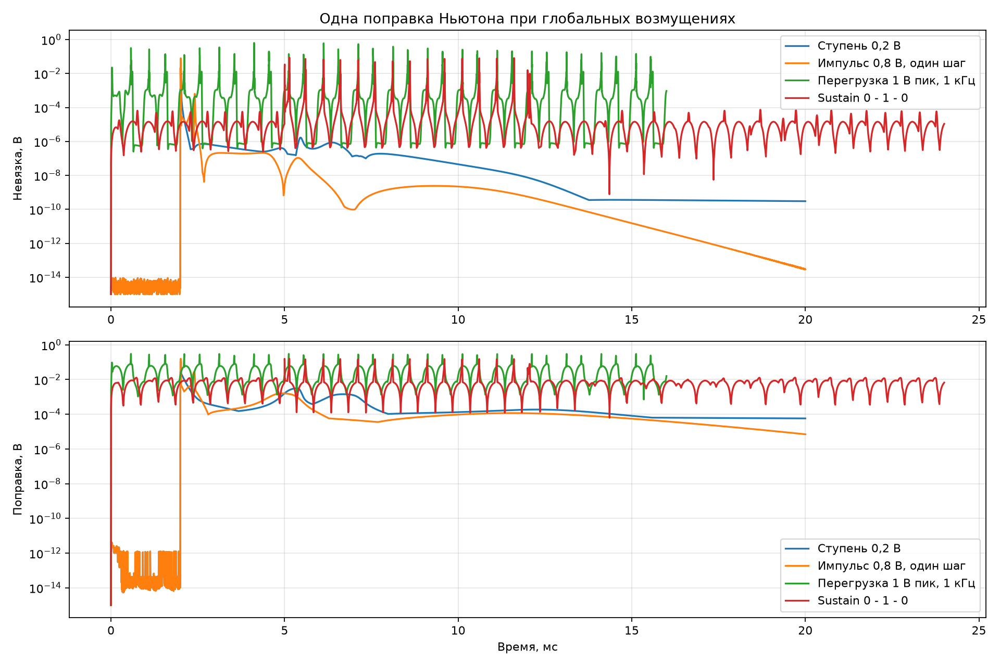
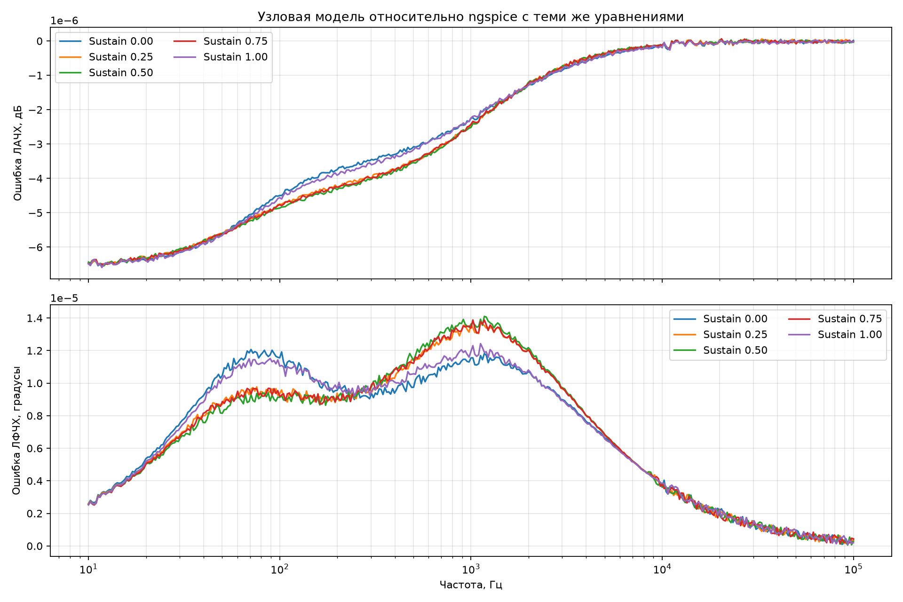

# Глобальная устойчивость входного тракта

## Что проверено

В единой модели Q4–Sustain–Q3–Q2 при 8× выполнены четыре жёстких опыта:
ступень 0,2 В, импульс 0,8 В длительностью один внутренний шаг, синусоидальная
перегрузка 1 В пик и скачок Sustain `0 → 1 → 0` без сброса зарядов конденсаторов.
Одна поправка Ньютона сравнивается с полностью сходящимся решением на том же шаге.

| Возмущение | Макс. невязка, В | Макс. поправка, В | Ошибка Q2 СКО, мВ | Пиковая ошибка Q2, мВ | Макс. отклонение Q2, В | Отношение хвостовых максимумов | Все числа конечны |
|---|---:|---:|---:|---:|---:|---:|:---:|
| Ступень 0,2 В | 4.685e-02 | 1.197e-01 | 0.166 | 12.954 | 0.473 | 0.5687 | да |
| Импульс 0,8 В, один шаг | 7.974e-02 | 1.588e-01 | 3.252 | 18.349 | 0.459 | 0.3913 | да |
| Перегрузка 1 В пик, 1 кГц | 6.316e-01 | 3.034e-01 | 5.528 | 114.363 | 0.490 | 0.9996 | да |
| Sustain 0 - 1 - 0 | 8.633e-02 | 1.584e-01 | 1.091 | 40.153 | 0.468 | 0.9835 | да |

Отношение хвостовых максимумов сравнивает два последних окна по 2 мс. Для
периодического сигнала значение около единицы нормально; рост заметно выше
единицы был бы признаком разгона.

## Независимая проверка ngspice

В `frontend_equation_reference.cir` записаны те же уравнения Эберса—Молла и
Шокли, что и в узловой модели. Это намеренная проверка топологии, знаков токов,
рабочей точки и линеаризации; она не подменяет будущего сравнения с расширенной
моделью BC239 и измеренной педалью.

- максимальная ошибка ЛАЧХ: `6.592e-06` дБ;
- среднеквадратическая ошибка ЛФЧХ: `8.051e-06` градуса.

## Вывод

Все четыре возмущения остаются ограниченными и не дают накопительного роста.
Наиболее тяжёлый режим — синусоидальная перегрузка 1 В пик: невязка одной
поправки велика, поэтому пиковую ошибку нельзя оценивать по одной невязке —
в таблице приведено непосредственное сравнение выходного напряжения с полным
схождением. Скачок Sustain переносит физическое состояние без сброса и также
не вызывает разгона.

Локальная и проверенная здесь крупносигнальная устойчивость достаточны, чтобы
присоединять полный темброблок и выходной Q1. Проверка должна повторяться после
каждого расширения системы.
