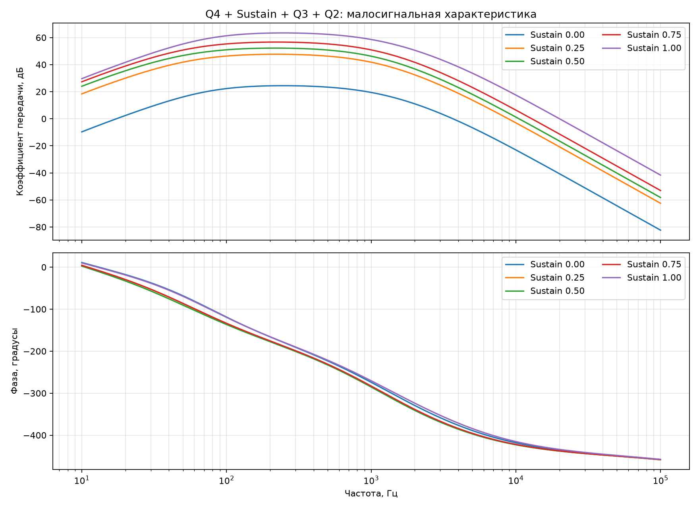
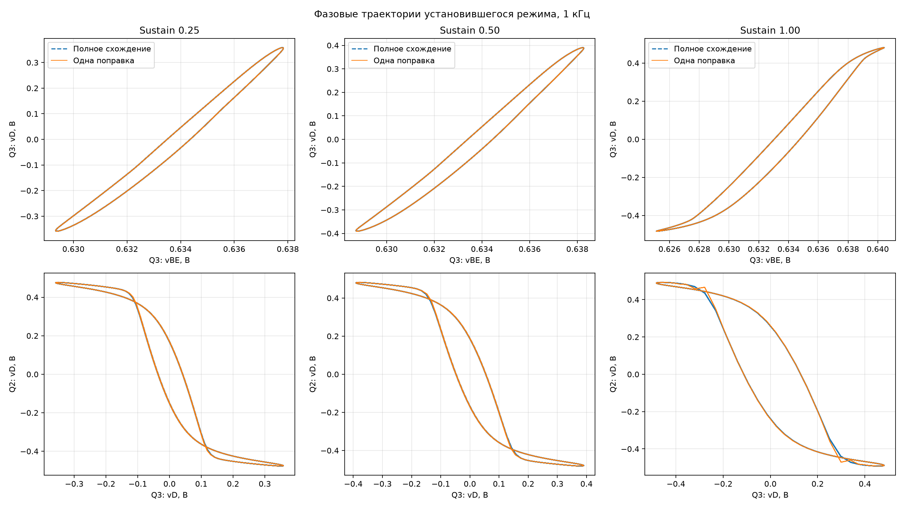
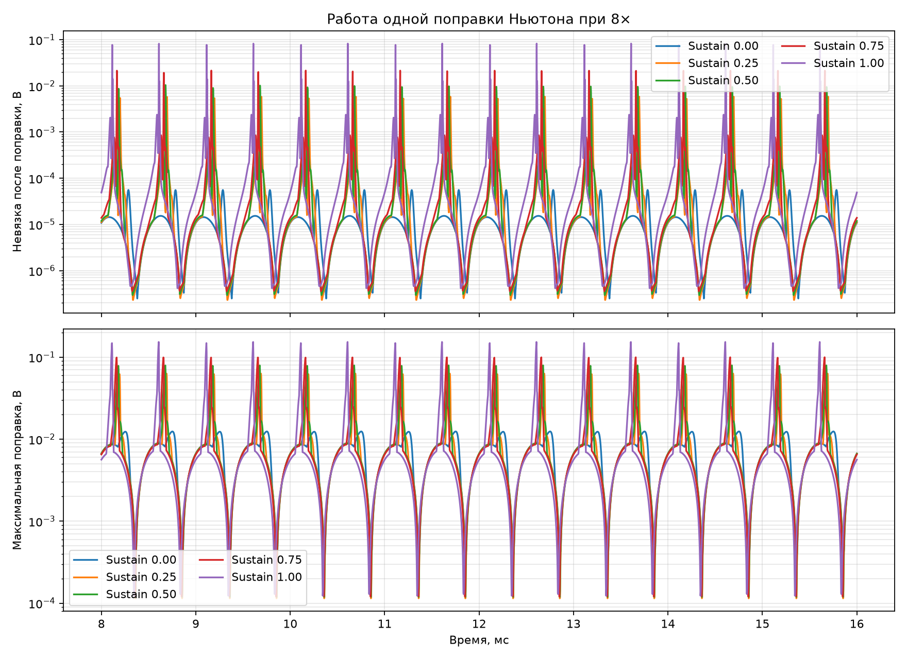

# Входной каскад, Sustain и устойчивость ограничителей

## Состав модели

В единую узловую систему добавлены Q4, R2/C1, коллекторно-базовая обратная
связь R9/C10, C4, настоящий потенциометр Sustain, R23 и C5. Далее без разрыва
следуют связанные Q3 и Q2 и линейная нагрузка темброблока. Рабочая архитектура
остаётся гибридной: Q4 и Q3 полные, транзистор Q2 линеаризован около рабочей
точки, диодная пара Q2 нелинейна.

## Как проверяется устойчивость

ЛАЧХ и ЛФЧХ ниже являются характеристиками замкнутой схемы около рабочей
точки. Они показывают резонансные подъёмы и фазовое вращение, но не являются
формальным запасом фазы разомкнутой петли.

Для фактического алгоритма дополнительно численно построен якобиан отображения
одного шага 8×. В состояние входят напряжения всех конденсаторов и нелинейные
напряжения-предикторы. Спектральный радиус меньше единицы означает локальное
затухание малых возмущений. Очень медленный доминирующий режим ожидаем: ёмкости
C6/C7 заряжаются через малую дифференциальную проводимость диодных пар около
нулевого напряжения. Угол доминирующего собственного числа во всех пяти точках равен 0°,
то есть медленный режим не колебательный.

| Sustain | Спектральный радиус | Затухание, ppm/шаг | Экв. время, с | Макс. усиление, дБ | Частота максимума, Гц | Макс. невязка, В | Макс. поправка, В | Q3 размах, В | Q2 размах, В | Ср. кв. ошибка 1 поправки, мВ | Пиковая ошибка, мВ |
|---:|---:|---:|---:|---:|---:|---:|---:|---:|---:|---:|---:|
| 0.00 | 0.999999795 | 0.205 | 12.715 | 24.43 | 248.2 | 5.583e-05 | 1.240e-02 | 0.123 | 0.724 | 0.050 | 0.136 |
| 0.25 | 0.999999795 | 0.205 | 12.712 | 47.66 | 218.1 | 5.868e-03 | 6.302e-02 | 0.687 | 0.910 | 0.383 | 3.497 |
| 0.50 | 0.999999796 | 0.204 | 12.741 | 52.21 | 218.1 | 1.041e-02 | 7.936e-02 | 0.748 | 0.918 | 0.500 | 5.618 |
| 0.75 | 0.999999796 | 0.204 | 12.765 | 56.66 | 222.2 | 2.149e-02 | 9.959e-02 | 0.808 | 0.925 | 0.692 | 7.525 |
| 1.00 | 0.999999795 | 0.205 | 12.709 | 63.41 | 248.2 | 8.252e-02 | 1.531e-01 | 0.912 | 0.936 | 1.370 | 12.173 |

## Критерии тревоги

- спектральный радиус `>= 1`;
- незамкнутая или распухающая фазовая траектория при периодическом входе;
- рост невязки от периода к периоду;
- поправка, выводящая аргумент CORDIC за прямой диапазон;
- узкий подъём ЛАЧХ, отсутствующий в ngspice.

## Вывод

Во всех пяти положениях регулятора спектральный радиус меньше единицы, а фазовые
траектории замыкаются: схема и одна поправка локально устойчивы. При Sustain = 1
невязка доходит до 82,5 мВ, но ошибка выхода Q2 относительно полного схождения
остаётся 1,37 мВ среднеквадратически и 12,2 мВ в пике. Поэтому излом фазовой траектории
в основном физический; численная ошибка видна как небольшое расхождение с штриховой эталонной кривой.
Окончательная проверка глобальной устойчивости потребует ступени, импульса,
перегрузки входа и резкого движения регулятора между крайними положениями.
