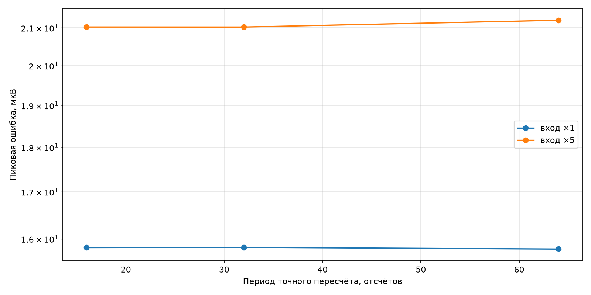

# Сохранение шести нелинейностей

Все четыре экспоненциальные и две диодные нелинейности полной педали обновляются кубическими многочленами малого приращения. При модуле приведённого приращения выше 0,25 выполняется немедленный точный пересчёт; дополнительно весь набор восстанавливается периодически.

| Усиление входа | Период | СКО, мкВ | Пик, мкВ | Аварийные пересчёты | Макс. приращение |
|---:|---:|---:|---:|---:|---:|
| 1 | 16 | 1.891 | 15.821 | 97 | 1.812 |
| 1 | 32 | 1.883 | 15.826 | 97 | 1.812 |
| 1 | 64 | 1.879 | 15.792 | 97 | 1.812 |
| 5 | 16 | 2.631 | 21.021 | 102 | 3.764 |
| 5 | 32 | 3.773 | 21.020 | 102 | 3.764 |
| 5 | 64 | 3.782 | 21.204 | 102 | 3.764 |

Аппаратный вариант с периодом 32 занял 3551 такт в среднем для дешёвого решателя против 4496 у абсолютного пересчёта. После перехода на период 64 средняя цена уменьшилась до **3539 тактов**, максимум остался равен 4362 тактам. Нечисловых результатов нет. Конечный выход аппаратного потока отличается от прежнего абсолютного варианта на 0,094 мВ.

## DMA

STM32G474 действительно поддерживает DMA для CORDIC: запрос чтения имеет номер 112, записи — 113; в `CORDIC_CSR` предусмотрены `DMAREN` и `DMAWEN`. Однако нормальный многочленный шаг CORDIC больше не вызывает. DMA имеет смысл для редкого пакетного восстановления шести значений и для звуковых АЦП/ЦАП, но не заменяет арифметику ядра.

Главная польза звукового двойного буфера — срок задаётся средней ценой полубуфера, а не самым дорогим отдельным отсчётом. Поэтому редкий пик 4362 такта допустим, если весь блок успевает обработаться до следующего события DMA.
