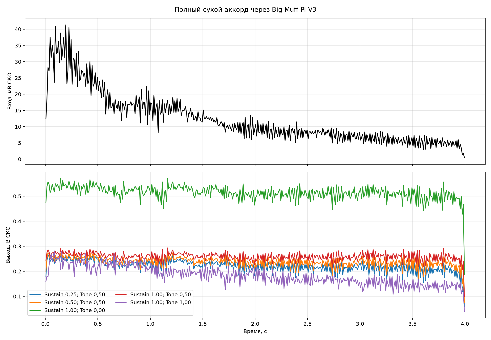

# Полный гитарный аккорд через педаль

Четырёхсекундный сухой ми-мажорный аккорд пропущен через полную эталонную
схему Big Muff Pi V3 в ngspice. Вход приведён к 100 мВ пик. Внутренний максимальный шаг
решателя равен 1/384000 с, выходные WAV — моно PCM16, 48 кГц.

Все варианты имеют единый масштаб амплитуды. Volume везде равен 0,8, поэтому разница
громкости между файлами сохранена.

| Sustain; Tone | Volume | Выход, мВ СКО | Пик, В | Расчёт, с | Звук |
|---|---:|---:|---:|---:|---|
| Sustain 0,25; Tone 0,50 | 0.80 | 222.58 | 0.409 | ранее | [sustain_025_tone_050.wav](sustain_025_tone_050.wav) |
| Sustain 0,50; Tone 0,50 | 0.80 | 237.68 | 0.431 | ранее | [sustain_050_tone_050.wav](sustain_050_tone_050.wav) |
| Sustain 1,00; Tone 0,00 | 0.80 | 515.01 | 0.843 | ранее | [sustain_100_tone_000.wav](sustain_100_tone_000.wav) |
| Sustain 1,00; Tone 0,50 | 0.80 | 259.67 | 0.484 | ранее | [sustain_100_tone_050.wav](sustain_100_tone_050.wav) |
| Sustain 1,00; Tone 1,00 | 0.80 | 187.27 | 1.542 | ранее | [sustain_100_tone_100.wav](sustain_100_tone_100.wav) |

- [Сухой вход 100 мВ](input_100mv.wav)
- [Все пять положений подряд](all_settings.wav) — порядок совпадает с таблицей, между
  вариантами оставлено по 0,5 с тишины.

Это эталонная SPICE-схема с предварительными моделями BC239 и 1N914, а не ещё не перенесённая
на STM32 сокращённая модель. Файлы показывают звук полной схемы и будут служить опорой
для последующего сравнения.
