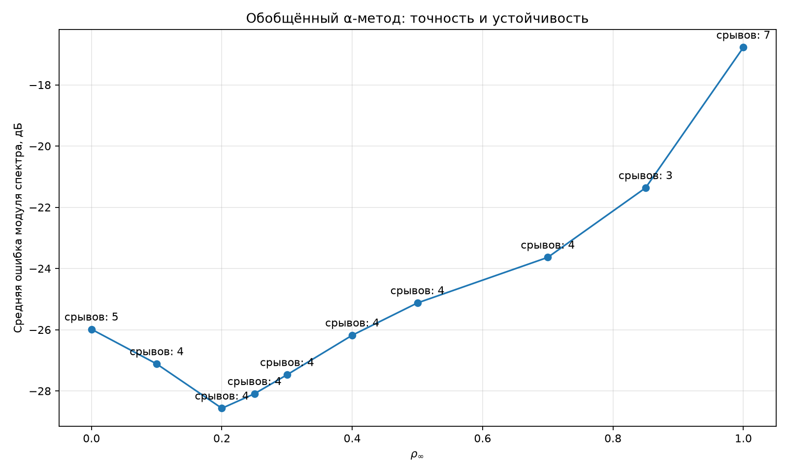

# Обобщённый α-метод

Проверен метод второго порядка для систем первого порядка с управляемым
высокочастотным затуханием. Значение `rho=1` сохраняет предельную высокочастотную
моду, `rho=0` максимально её подавляет.

## Сводка

| rho | Число срывов | Средняя ошибка спектра исправных точек, дБ |
|---:|---:|---:|
| 0 | 5 | -25.99 |
| 0.1 | 4 | -27.12 |
| 0.2 | 4 | -28.57 |
| 0.25 | 4 | -28.09 |
| 0.3 | 4 | -27.47 |
| 0.4 | 4 | -26.18 |
| 0.5 | 4 | -25.13 |
| 0.7 | 4 | -23.64 |
| 0.85 | 3 | -21.37 |
| 1 | 7 | -16.78 |

## Синусы

| Частота, Гц | Вход, мВ | rho | Ошибка формы, % | Ошибка спектра, дБ | Чередующаяся доля |
|---:|---:|---:|---:|---:|---:|
| 440 | 5 | 0 | 3.484 | -33.28 | 2.154e-06 |
| 440 | 5 | 0.1 | 3.083 | -36.54 | 2.245e-06 |
| 440 | 5 | 0.2 | 3.044 | -36.75 | 7.238e-06 |
| 440 | 5 | 0.25 | 3.105 | -35.88 | 9.848e-06 |
| 440 | 5 | 0.3 | 3.198 | -34.86 | 1.250e-05 |
| 440 | 5 | 0.4 | 3.425 | -32.99 | 1.785e-05 |
| 440 | 5 | 0.5 | 3.666 | -31.53 | 2.324e-05 |
| 440 | 5 | 0.7 | 4.100 | -29.49 | 3.453e-05 |
| 440 | 5 | 0.85 | 4.377 | -28.36 | 4.536e-05 |
| 440 | 5 | 1 | 4.711 | -27.21 | 2.007e-03 |
| 440 | 25 | 0 | 3.966 | -28.86 | 4.135e-05 |
| 440 | 25 | 0.1 | 3.610 | -31.79 | 1.910e-05 |
| 440 | 25 | 0.2 | 4.435 | -31.24 | 1.446e-05 |
| 440 | 25 | 0.25 | 5.017 | -29.89 | 3.455e-05 |
| 440 | 25 | 0.3 | 5.629 | -28.42 | 5.633e-05 |
| 440 | 25 | 0.4 | 6.859 | -25.75 | 1.040e-04 |
| 440 | 25 | 0.5 | 8.063 | -23.56 | 1.570e-04 |
| 440 | 25 | 0.7 | 10.567 | -20.04 | 2.944e-04 |
| 440 | 25 | 0.85 | 13.155 | -17.46 | 4.709e-04 |
| 440 | 25 | 1 | 20.612 | -12.97 | 6.838e-03 |
| 440 | 100 | 0 | СРЫВ | — | — |
| 440 | 100 | 0.1 | СРЫВ | — | — |
| 440 | 100 | 0.2 | СРЫВ | — | — |
| 440 | 100 | 0.25 | СРЫВ | — | — |
| 440 | 100 | 0.3 | СРЫВ | — | — |
| 440 | 100 | 0.4 | СРЫВ | — | — |
| 440 | 100 | 0.5 | СРЫВ | — | — |
| 440 | 100 | 0.7 | СРЫВ | — | — |
| 440 | 100 | 0.85 | 34.518 | -10.05 | 1.922e-02 |
| 440 | 100 | 1 | СРЫВ | — | — |
| 1000 | 5 | 0 | 5.014 | -30.11 | 3.414e-04 |
| 1000 | 5 | 0.1 | 4.653 | -34.04 | 3.906e-04 |
| 1000 | 5 | 0.2 | 4.796 | -35.07 | 4.217e-04 |
| 1000 | 5 | 0.25 | 4.992 | -33.74 | 4.315e-04 |
| 1000 | 5 | 0.3 | 5.240 | -32.09 | 4.379e-04 |
| 1000 | 5 | 0.4 | 5.824 | -29.13 | 4.418e-04 |
| 1000 | 5 | 0.5 | 6.460 | -26.89 | 4.363e-04 |
| 1000 | 5 | 0.7 | 7.787 | -23.74 | 4.307e-04 |
| 1000 | 5 | 0.85 | 8.959 | -21.81 | 6.017e-04 |
| 1000 | 5 | 1 | 23.924 | -12.76 | 1.911e-01 |
| 1000 | 25 | 0 | 4.111 | -29.00 | 2.208e-05 |
| 1000 | 25 | 0.1 | 4.579 | -28.20 | 2.295e-04 |
| 1000 | 25 | 0.2 | 6.707 | -24.31 | 5.817e-04 |
| 1000 | 25 | 0.25 | 7.713 | -22.95 | 7.994e-04 |
| 1000 | 25 | 0.3 | 8.581 | -21.93 | 1.039e-03 |
| 1000 | 25 | 0.4 | 9.874 | -20.64 | 1.548e-03 |
| 1000 | 25 | 0.5 | 10.701 | -19.93 | 2.041e-03 |
| 1000 | 25 | 0.7 | 11.683 | -19.16 | 2.960e-03 |
| 1000 | 25 | 0.85 | 12.287 | -18.65 | 3.496e-03 |
| 1000 | 25 | 1 | СРЫВ | — | — |
| 1000 | 100 | 0 | СРЫВ | — | — |
| 1000 | 100 | 0.1 | СРЫВ | — | — |
| 1000 | 100 | 0.2 | СРЫВ | — | — |
| 1000 | 100 | 0.25 | СРЫВ | — | — |
| 1000 | 100 | 0.3 | СРЫВ | — | — |
| 1000 | 100 | 0.4 | СРЫВ | — | — |
| 1000 | 100 | 0.5 | СРЫВ | — | — |
| 1000 | 100 | 0.7 | СРЫВ | — | — |
| 1000 | 100 | 0.85 | СРЫВ | — | — |
| 1000 | 100 | 1 | СРЫВ | — | — |
| 3000 | 5 | 0 | 11.124 | -26.63 | 8.422e-04 |
| 3000 | 5 | 0.1 | 10.042 | -30.48 | 8.375e-04 |
| 3000 | 5 | 0.2 | 9.352 | -34.59 | 8.233e-04 |
| 3000 | 5 | 0.25 | 9.112 | -35.96 | 8.127e-04 |
| 3000 | 5 | 0.3 | 8.924 | -36.20 | 7.995e-04 |
| 3000 | 5 | 0.4 | 8.666 | -34.39 | 7.648e-04 |
| 3000 | 5 | 0.5 | 8.522 | -32.34 | 7.158e-04 |
| 3000 | 5 | 0.7 | 8.482 | -29.70 | 5.341e-04 |
| 3000 | 5 | 0.85 | 8.658 | -28.39 | 1.128e-04 |
| 3000 | 5 | 1 | 26.420 | -12.19 | 2.260e-01 |
| 3000 | 25 | 0 | 6.105 | -29.40 | 1.343e-03 |
| 3000 | 25 | 0.1 | 6.408 | -29.86 | 1.110e-03 |
| 3000 | 25 | 0.2 | 7.853 | -27.03 | 6.755e-04 |
| 3000 | 25 | 0.25 | 8.592 | -26.17 | 4.153e-04 |
| 3000 | 25 | 0.3 | 9.296 | -25.56 | 1.424e-04 |
| 3000 | 25 | 0.4 | 10.595 | -24.62 | 4.416e-04 |
| 3000 | 25 | 0.5 | 11.746 | -23.73 | 1.122e-03 |
| 3000 | 25 | 0.7 | 13.788 | -22.04 | 3.239e-03 |
| 3000 | 25 | 0.85 | 15.949 | -20.36 | 7.386e-03 |
| 3000 | 25 | 1 | СРЫВ | — | — |
| 3000 | 100 | 0 | СРЫВ | — | — |
| 3000 | 100 | 0.1 | СРЫВ | — | — |
| 3000 | 100 | 0.2 | СРЫВ | — | — |
| 3000 | 100 | 0.25 | СРЫВ | — | — |
| 3000 | 100 | 0.3 | СРЫВ | — | — |
| 3000 | 100 | 0.4 | СРЫВ | — | — |
| 3000 | 100 | 0.5 | СРЫВ | — | — |
| 3000 | 100 | 0.7 | СРЫВ | — | — |
| 3000 | 100 | 0.85 | СРЫВ | — | — |
| 3000 | 100 | 1 | СРЫВ | — | — |
| 6000 | 5 | 0 | 36.756 | -8.70 | 7.455e-05 |
| 6000 | 5 | 0.1 | 31.156 | -10.32 | 1.210e-04 |
| 6000 | 5 | 0.2 | 26.731 | -12.08 | 1.464e-04 |
| 6000 | 5 | 0.25 | 24.903 | -12.98 | 1.538e-04 |
| 6000 | 5 | 0.3 | 23.302 | -13.88 | 1.588e-04 |
| 6000 | 5 | 0.4 | 20.696 | -15.61 | 1.635e-04 |
| 6000 | 5 | 0.5 | 18.758 | -17.17 | 1.645e-04 |
| 6000 | 5 | 0.7 | 16.388 | -19.42 | 1.638e-04 |
| 6000 | 5 | 0.85 | 15.571 | -20.26 | 1.684e-04 |
| 6000 | 5 | 1 | 15.342 | -20.48 | 4.481e-03 |
| 6000 | 25 | 0 | 25.406 | -16.24 | 1.912e-04 |
| 6000 | 25 | 0.1 | 24.853 | -18.99 | 1.284e-04 |
| 6000 | 25 | 0.2 | 23.945 | -21.34 | 6.071e-06 |
| 6000 | 25 | 0.25 | 23.433 | -22.28 | 7.323e-05 |
| 6000 | 25 | 0.3 | 22.934 | -23.07 | 1.653e-04 |
| 6000 | 25 | 0.4 | 22.084 | -24.30 | 3.964e-04 |
| 6000 | 25 | 0.5 | 21.545 | -25.38 | 7.167e-04 |
| 6000 | 25 | 0.7 | 21.421 | -28.09 | 1.955e-03 |
| 6000 | 25 | 0.85 | 21.659 | -29.63 | 4.892e-03 |
| 6000 | 25 | 1 | СРЫВ | — | — |
| 6000 | 100 | 0 | СРЫВ | — | — |
| 6000 | 100 | 0.1 | СРЫВ | — | — |
| 6000 | 100 | 0.2 | СРЫВ | — | — |
| 6000 | 100 | 0.25 | СРЫВ | — | — |
| 6000 | 100 | 0.3 | СРЫВ | — | — |
| 6000 | 100 | 0.4 | СРЫВ | — | — |
| 6000 | 100 | 0.5 | СРЫВ | — | — |
| 6000 | 100 | 0.7 | СРЫВ | — | — |
| 6000 | 100 | 0.85 | СРЫВ | — | — |
| 6000 | 100 | 1 | СРЫВ | — | — |

## Аккорд

| Вход, мВ | rho | Ошибка формы, % | Ошибка спектра, дБ | Чередующаяся доля |
|---:|---:|---:|---:|---:|
| 25 | 0 | 3.695 | -31.65 | 7.639e-05 |
| 25 | 0.1 | 3.332 | -34.72 | 3.697e-05 |
| 25 | 0.2 | 3.470 | -34.87 | 1.648e-04 |
| 25 | 0.25 | 3.645 | -33.95 | 2.317e-04 |
| 25 | 0.3 | 3.859 | -32.82 | 2.999e-04 |
| 25 | 0.4 | 4.336 | -30.65 | 4.408e-04 |
| 25 | 0.5 | 4.834 | -28.81 | 5.897e-04 |
| 25 | 0.7 | 5.864 | -25.83 | 9.433e-04 |
| 25 | 0.85 | 6.858 | -23.67 | 1.334e-03 |
| 25 | 1 | 9.617 | -19.89 | 8.487e-03 |
| 100 | 0 | СРЫВ | — | — |
| 100 | 0.1 | 18.534 | -16.23 | 2.101e-03 |
| 100 | 0.2 | 4.628 | -28.38 | 1.341e-04 |
| 100 | 0.25 | 5.227 | -27.10 | 3.968e-05 |
| 100 | 0.3 | 5.883 | -25.88 | 2.306e-04 |
| 100 | 0.4 | 7.258 | -23.73 | 6.642e-04 |
| 100 | 0.5 | 8.666 | -21.94 | 1.182e-03 |
| 100 | 0.7 | 11.775 | -18.86 | 2.683e-03 |
| 100 | 0.85 | 15.202 | -16.38 | 4.814e-03 |
| 100 | 1 | 25.352 | -11.95 | 4.666e-02 |

## Вывод

Лучший общий компромисс данной сетки — `rho=0.2`. Он имеет наименьшую среднюю
ошибку спектра исправных точек и устойчив на аккордах 25 и 100 мВ. На аккорде
25 мВ ошибка формы равна 3,470%, ошибка спектра −34,87 дБ; на аккорде 100 мВ —
4,628% и −28,38 дБ. Максимально затухающий край `rho=0`, спектрально
эквивалентный BDF2, на сильном аккорде срывается.

Сильные непрерывные синусы 100 мВ остаются проблемными почти для всей сетки.
Это свойство полной узловой модели и отдельный вопрос от устойчивости на
реальном гитарном сигнале: составное C-ядро BDF2 ранее прошло полный аккорд без
срывов. Перенос `rho=0.2` в C требует отдельной проверки соответствия редукции.
