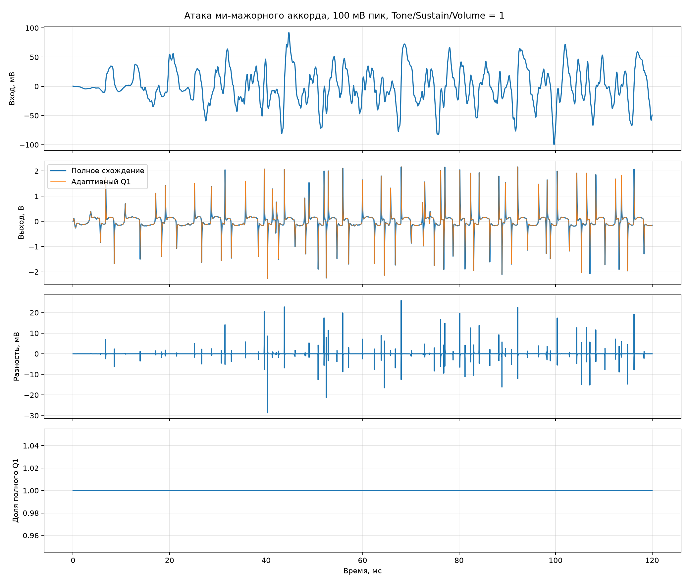

# Атака гитарного аккорда

Вход — первые 120 мс сухого ми-мажорного аккорда `E2–B2–E3–G♯3–B3–E4`.
Амплитуда приведена к 100 мВ пик. Частота расчёта 384 кГц, Tone, Sustain и Volume установлены в 1.

| Величина | Значение |
|---|---:|
| Ошибка адаптивной модели, СКО | 0.679 мВ |
| Пиковая ошибка | 28.60 мВ |
| Ошибка выше 10 кГц, СКО | 0.630 мВ |
| Время в линейной ветви Q1 | 0.0 % |
| Аварийные входы в линейную ветвь | 0 |
| Время расчёта эталона | 30.3 с |
| Время расчёта адаптивной модели | 24.6 с |

Для прослушивания отрезок повторён восемь раз с паузой 180 мс. Эталон и адаптивный
вариант записаны с общим масштабом, поэтому сравнивать их можно напрямую:

- [сухой вход 100 мВ](input_100mv_repeated.wav);
- [полное схождение](reference_repeated.wav);
- [адаптивный Q1](adaptive_repeated.wav);
- [разность, усиленная в 10 раз](difference_x10_repeated.wav).

Полный четырёхсекундный сухой аккорд лежит в `simulation/samples/e_major_chord/e_major_dry.wav`.
