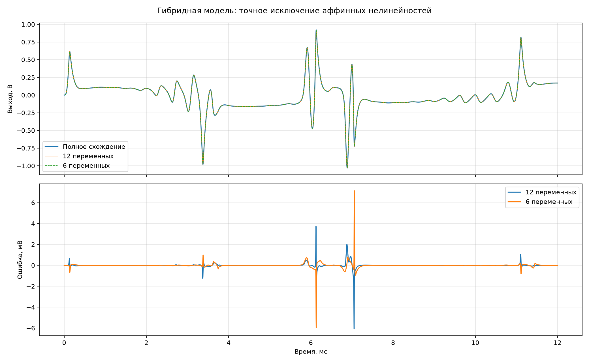

# Шесть активных нелинейностей

В выбранной гибридной физике из 12 нелинейных напряжений только 6 остаются
действительно нелинейными: `I_F(Q4)`, `I_F(Q3)`, диоды Q3, диоды Q2, `I_F(Q1)` и `I_R(Q1)`.
Три запертых обратных перехода, две неиспользуемые переменные и линеаризованный
`I_F(Q2)` исключены алгебраически.

При полной сходимости максимальная разность двух форм записи составляет
`0.338` нВ по узлам и `0.427` нВ по нелинейным
напряжениям. То есть само исключение не меняет решение в пределах численной точности.

| Tone | 12×12: ошибка, мВ СКО | 12×12: пик, мВ | 12×12: невязка, В | 6×6: ошибка, мВ СКО | 6×6: пик, мВ | 6×6: невязка, В | 12×12, с | 6×6, с | Ускорение |
|---:|---:|---:|---:|---:|---:|---:|---:|---:|---:|
| 0.00 | 0.082 | 0.62 | 2.796e-03 | 0.060 | 0.36 | 4.203e-03 | 2.741 | 2.590 | 1.06 |
| 0.50 | 0.092 | 2.15 | 2.771e-03 | 0.106 | 2.81 | 4.271e-03 | 2.690 | 2.545 | 1.06 |
| 1.00 | 0.227 | 6.08 | 2.724e-03 | 0.270 | 7.14 | 4.180e-03 | 2.619 | 2.543 | 1.03 |

Сравнение выполнено с эталоном той же гибридной физики, доведённым до полной сходимости.
Оба быстрых варианта делают одну общую поправку и одну местную поправку Q1. Это проверка
влияния исключения, а не ещё замер тактов STM32.
