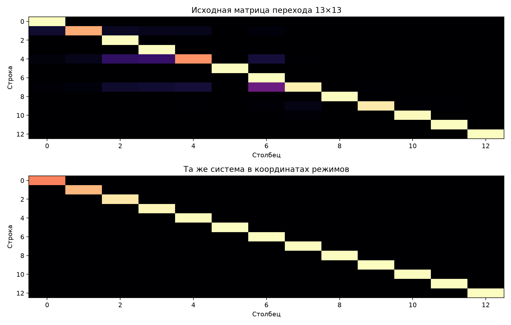
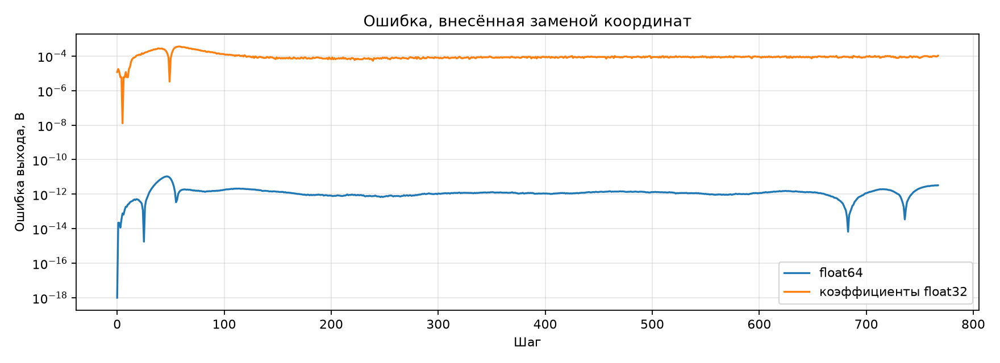

# Диагональные координаты линейного состояния

Напряжения 13 конденсаторов заменены 13 независимыми режимами той же линейной системы. Физика и нелинейные уравнения не меняются. Матрица перехода преобразована как `V⁻¹ A V` и стала диагональной.

- число обусловленности преобразования: 55.058;
- наибольшая мнимая часть: 0.000e+00;
- коэффициенты перехода выше порога \(10^{-12}\): 118 → 13;
- умножения для перехода состояния: 169 → 13.

| Точность коэффициентов | СКО выхода, В | Пиковая ошибка выхода, В | Пиковая ошибка состояния, В |
|---|---:|---:|---:|
| float64 | 1.751e-12 | 1.065e-11 | 2.617e-11 |
| float32 | 1.089e-04 | 3.611e-04 | 2.446e-04 |

## Вывод

Это точная алгебраическая замена координат. После проверки округления `float32` диагональный переход перенесён в измеритель STM32. Обновление состояния и выхода сократилось с 1938 до 1245 тактов, а после отдельной перестройки проекции 6×6 и разбиения длинных сумм — до **1154 тактов**. Полный дешёвый шаг сократился с 5255 до **4496 тактов**. Оба аппаратных прогона устойчивы, нечисловых значений нет.
