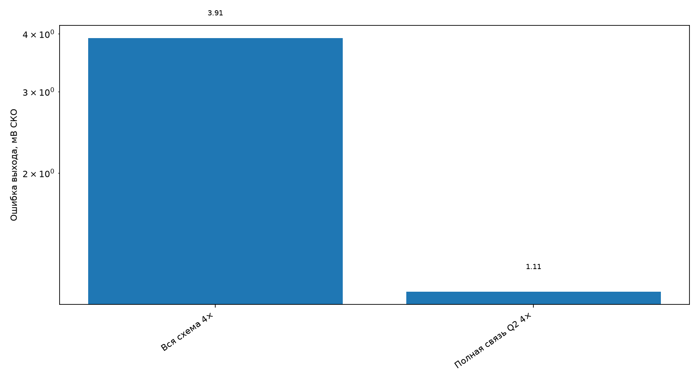
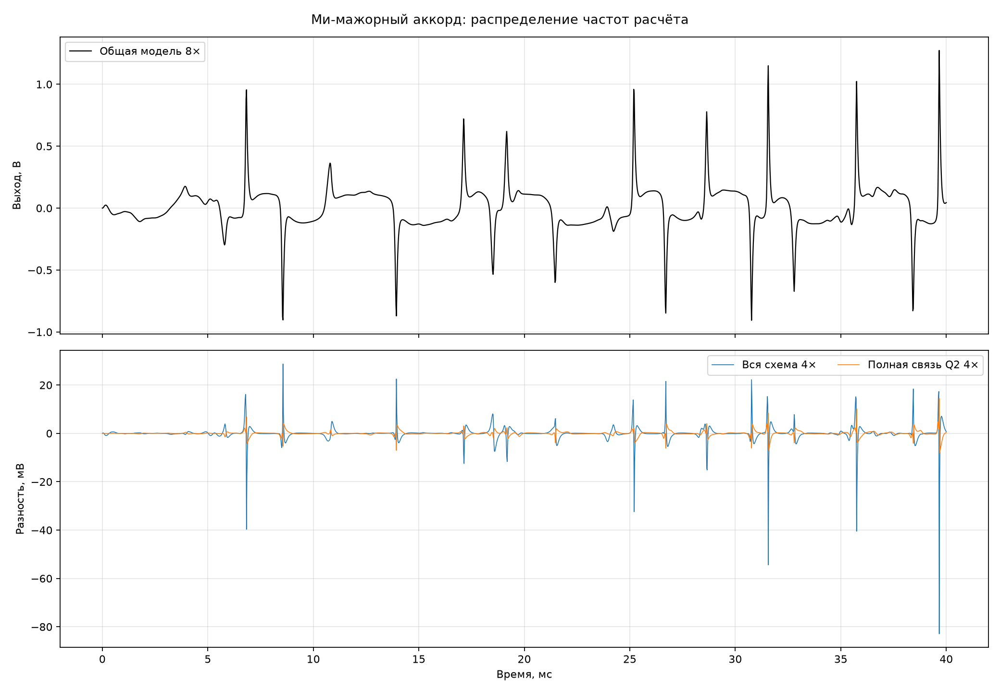

# Разнос блоков по частотам расчёта

Проверка выполнена на первых 40 мс сухого ми-мажорного аккорда,
25 мВ пик, Sustain = Tone = 1 и Volume = 0,8. Общая каскадная модель 8×
со связанным блоком Q4+Q3+Q2 служит нулём сравнения. Значения выхода
сопоставляются в одинаковые моменты сетки 48 кГц;
первые 5 мс исключены из СКО.

| Режим | Ошибка, мВ СКО | Пик, мВ | Ошибка выше 10 кГц, мВ СКО | Макс. невязка, В | Местных поправок на отсчёт 48 кГц |
|---|---:|---:|---:|---:|---:|
| Вся схема 1× | неустойчив | неустойчив | неустойчив | 5.869e+30 | 3.0 |
| Вся схема 2× | неустойчив | неустойчив | неустойчив | 2.060e+30 | 6.0 |
| Вся схема 4× | 3.915 | 82.92 | 2.322 | 2.506e-02 | 12.0 |
| Q1 4× | неустойчив | неустойчив | неустойчив | 1.924e+30 | 16.0 |
| Q1 2× | неустойчив | неустойчив | неустойчив | 1.924e+30 | 12.0 |
| Q1 1× | неустойчив | неустойчив | неустойчив | 5.960e+29 | 10.0 |
| Полная связь Q2 4× | 1.107 | 14.49 | 0.614 | 4.633e-02 | 24.0 |
| Полная связь Q2 2× | неустойчив | неустойчив | неустойчив | 6.649e+29 | 24.0 |
| Полная связь Q2 1× | неустойчив | неустойчив | неустойчив | 2.370e+30 | 24.0 |

## Что именно проверено

В вариантах с разной частотой блоков все 13 накопителей пока обновляются на 384 кГц.
На каждом внутреннем шаге решается связанный блок Q4+Q3. С указанным периодом он
заменяется полной синхронизацией Q4+Q3+Q2 размером 4×4. Две местные поправки Q1
выполняются только с собственным периодом; между ними используется предсказанное
состояние прошлого малого шага. Поэтому опыт отделяет требуемую частоту нелинейных
решений от будущего разбиения линейных накопителей.

Лучший устойчивый разреженный режим — **Полная связь Q2 4×**: ошибка 1.107 мВ СКО.

Из общих частот устойчивым сокращением относительно 8× оказался режим **4×**.
Он дал 3.915 мВ СКО
на этом входном уровне. Режимы 1× и 2× сорвались.

## Предварительный бюджет отдельного Q3–Q2

Ранее измеренный связанный Q3–Q2 стоит 280–289 тактов на внутренний шаг.
Поэтому только этот блок потребует 1156 тактов на внешний отсчёт при 4× или
2312 при 8×. Из общего бюджета 3542 такта остаётся соответственно около
2386 или 1230 тактов на Q4, Sustain, темброблок, Q1, преобразователи частоты
и ввод-вывод. Это пока верхнеуровневая оценка: Q4 сильно связан с Q3 и его
нельзя автоматически вынести в медленную часть.

## Такты блочных поправок на STM32

После численного опыта в измеритель добавлены целые рабочие блоки. В отдельной
дешёвой сборке `Q4+Q3 3×3 → Q2 1×1` занял 837 тактов. В надёжной сборке единый
`Q4+Q3+Q2 4×4` занял 917 тактов; разница равна 80 тактам. Одна местная поправка
Q1 заняла 391 такт, две последовательные — 677 тактов в надёжной сборке.

Устойчивый режим «полная связь Q2 4× при общей сетке 8×» чередует дешёвый и
надёжный входные блоки. Его средняя цена входной поправки равна примерно
`(837 + 917)/2 = 877` тактов на внутренний шаг, то есть экономия относительно
постоянного 4×4 составляет около `8·40 = 320` тактов на внешний отсчёт 48 кГц.
Абсолютная цена полного потока после добавления измерительных участков изменилась
из-за размещения кода, поэтому для архитектурного вывода используется устойчивая
разность блоков, совпадающая с прежней разностью полных сборок 83 такта.

## Ограничение результата

Это ещё не окончательная многоскоростная схема: общая матрица состояния сохраняет
обратные связи через разделительные конденсаторы. Следующая реализация должна разорвать
систему только по физическим портам C5 и темброблока, добавить линейное повышение и
понижение частоты и затем снова сравнить весь выход с общей моделью 8×. Нельзя просто
заморозить произвольные строки общей матрицы — это изменит проводимости конденсаторов.
