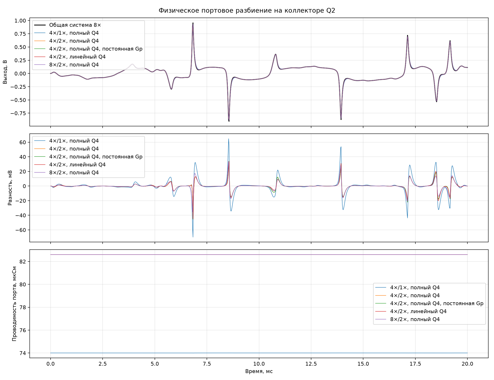
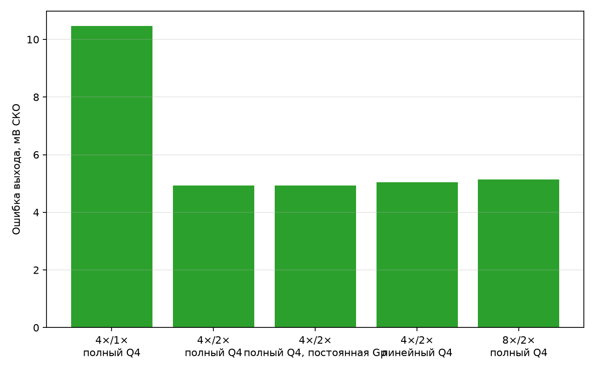

# Портовая многоскоростная модель

Быстрая подсистема содержит Q4, Sustain, Q3 и Q2. Медленная подсистема содержит
C9, C8, Tone, C10, Q1, C11, Volume и выход. Граница проходит по коллектору Q2.
Медленная часть представляется для быстрого ядра эквивалентом Нортона
`i = Gp·vp + I0`; ток и касательная проводимость обновляются раз в отсчёт 48 кГц.
В режимах медленной части 2× они обновляются дважды за внешний отсчёт.

Вход — первые 20 мс ми-мажорного аккорда, 25 мВ пик.
Эталон — общая гибридная модель с полным схождением при 8×. Первые 3 мс исключены
из среднеквадратических ошибок.

| Быстро/медленно | Q4 | Выход, мВ СКО | Пик, мВ | Выше 10 кГц, мВ СКО | Порт Q2, мВ СКО | Gp, мкСм | Невязка быстрой | Невязка медленной |
|---|---|---:|---:|---:|---:|---:|---:|---:|
| 4×/1× | полный Q4 | 10.458 | 69.93 | 1.161 | 1.500 | 73.999…74.005 | 9.95e-13 | 9.81e-13 |
| 4×/2× | полный Q4 | 4.935 | 45.36 | 0.959 | 1.327 | 82.595…82.603 | 9.91e-13 | 9.99e-13 |
| 4×/2× | полный Q4, постоянная Gp | 4.935 | 45.36 | 0.959 | 1.327 | 82.595…82.603 | 9.91e-13 | 9.81e-13 |
| 4×/2× | линейный Q4 | 5.050 | 44.86 | 0.936 | 1.282 | 82.595…82.603 | 9.97e-13 | 9.74e-13 |
| 8×/2× | полный Q4 | 5.135 | 35.27 | 0.445 | 0.500 | 82.595…82.603 | 9.98e-13 | 9.74e-13 |

Замораживание `Gp` практически не изменило результат: в таблице ошибки совпадают
до 0,001 мВ. Поэтому в рабочем варианте матрица быстрого ядра постоянна, а медленная
подсистема обновляет только эквивалентный источник `I0`.

## Рабочий кандидат

Основной точный режим — `4×/2×` с полным Q4 и постоянной `Gp`. Его ошибка относительно
общей модели составляет 4.935 мВ СКО.
Непосредственная разность между полным и линейным Q4 в одной портовой архитектуре —
0.640 мВ СКО и 4.32 мВ в пике на входе 25 мВ. Линейный Q4 остаётся ускоренной
ветвью тихого сигнала, но не заменяет полную модель на сильной атаке.

По ранее измеренным ядрам Q3–Q2 при 4× требует около 1156 тактов на внешний отсчёт,
а две поправки Q1 при 2× — около 1354 тактов. Сумма нелинейных решений равна примерно
2510 тактам из бюджета 3542; остаётся около 1032 тактов на линейные накопители,
порт, изменение частоты и ввод-вывод в тихой ветви. Полную цену Q4 для сильного
сигнала теперь надо измерить в отдельном портовом C-ядре.
