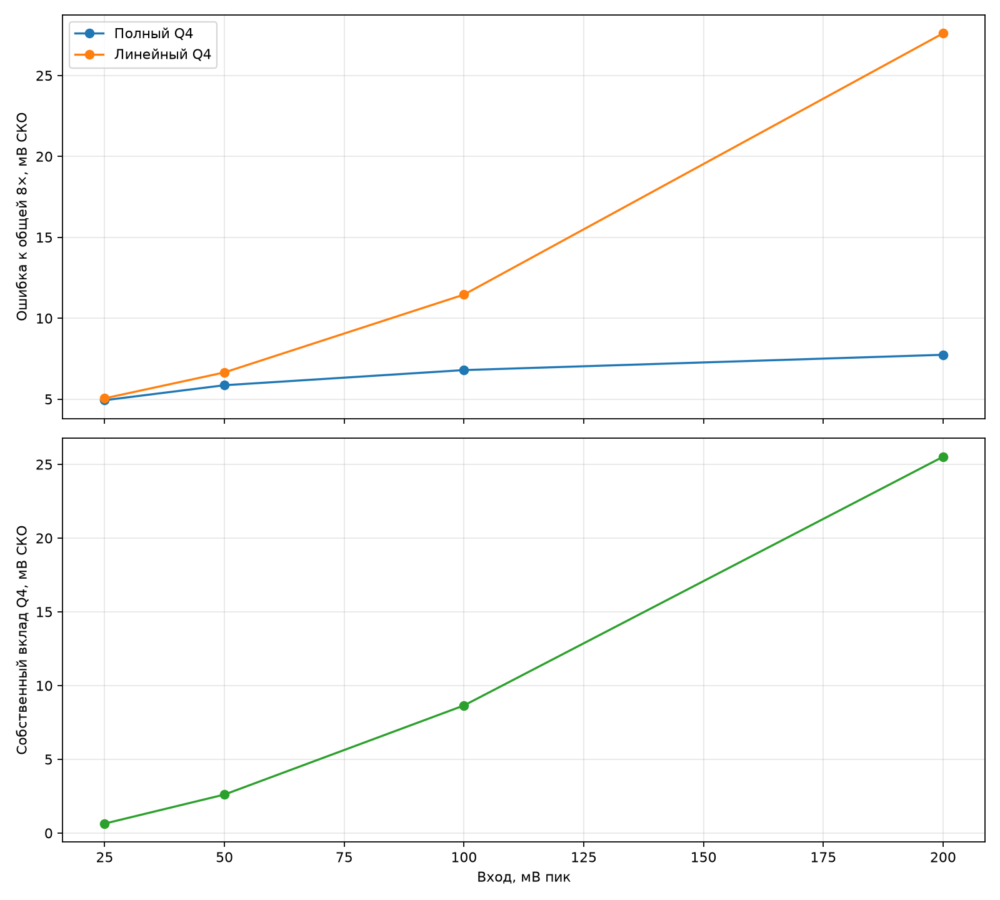
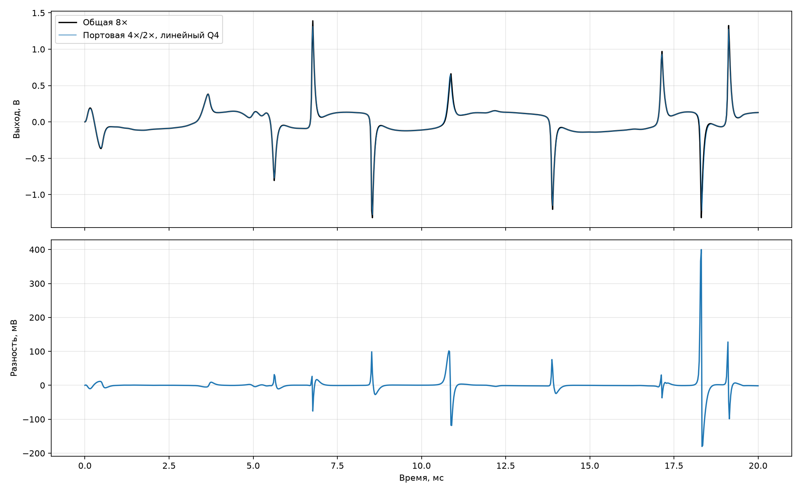

# Уровни портовой модели 4×/2×

Проверена атака ми-мажорного аккорда при Tone = Sustain = 1 и Volume = 0,8.
Эталон — общая гибридная система с полным схождением при 8×. Портовая модель
решается с полным схождением; первые 3 мс исключены из СКО.

| Вход, мВ пик | Полный Q4, мВ СКО | Линейный Q4, мВ СКО | Пик ошибки, мВ | Вклад Q4, мВ СКО | Пик вклада Q4, мВ | Gp, мкСм | Невязка быстрой | Невязка медленной |
|---:|---:|---:|---:|---:|---:|---:|---:|---:|
| 25 | 4.935 | 5.050 | 44.86 | 0.640 | 4.32 | 82.595…82.603 | 9.97e-13 | 9.74e-13 |
| 50 | 5.860 | 6.651 | 52.48 | 2.609 | 22.14 | 82.594…82.604 | 9.96e-13 | 9.78e-13 |
| 100 | 6.796 | 11.459 | 133.07 | 8.650 | 103.29 | 82.592…82.604 | 9.97e-13 | 9.36e-13 |
| 200 | 7.741 | 27.603 | 399.87 | 25.516 | 340.52 | 82.591…82.604 | 9.70e-13 | 9.95e-13 |

Полный Q4 сохраняет устойчивость и ограничивает рост ошибки до 7,741 мВ СКО при
200 мВ. Постоянная линеаризация приемлема только на тихом входе: её собственный
вклад превышает 8 мВ СКО при 100 мВ. Поэтому она может включаться адаптивно по
огибающей, а не использоваться как единственная физическая модель.
