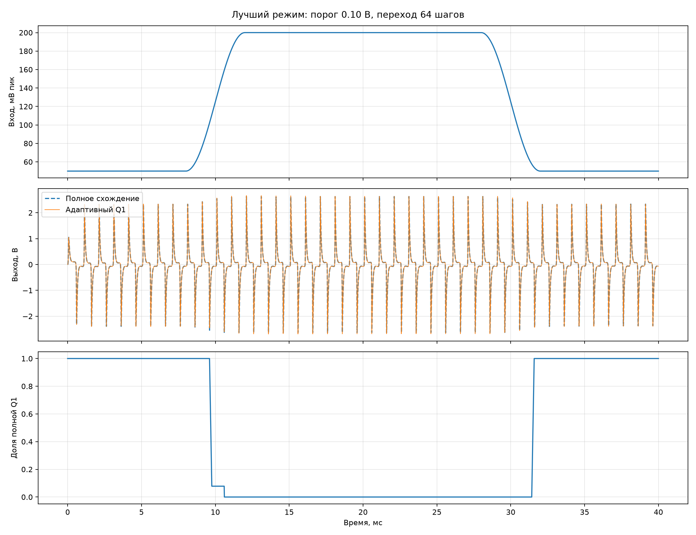

# Адаптивный выходной Q1

Уровень синуса 1 кГц плавно меняется `50 → 200 → 50` мВ пик при Tone, Sustain и Volume = 1.
Предварительный уход начинается при огибающей `V_BC = 0,48` В, возврат разрешён ниже 0,30 В.
Невязка служит второй защитой: предупредительные пороги указаны в таблице, а при 0,5 В
выполняется аварийный повтор текущего шага с линейным Q1. Возврат по невязке разрешён ниже 0,06 В.

| Порог, В | Переход, шагов | Ошибка, мВ СКО | Пик, мВ | Ошибка выше 10 кГц, мВ СКО | Макс. изменение ошибки за шаг, В | Линейная ветвь, % | Входы в линейную ветвь |
|---:|---:|---:|---:|---:|---:|---:|---:|
| 0.10 | 64 | 6.627 | 118.12 | 5.488 | 0.1503 | 52.0 | 1 |
| 0.10 | 256 | 6.656 | 123.30 | 5.568 | 0.1521 | 52.1 | 1 |
| 0.15 | 64 | 6.627 | 118.12 | 5.488 | 0.1503 | 52.0 | 1 |
| 0.15 | 256 | 6.656 | 123.30 | 5.568 | 0.1521 | 52.1 | 1 |
| 0.25 | 64 | 6.638 | 120.46 | 5.499 | 0.1527 | 52.0 | 1 |
| 0.25 | 256 | 6.657 | 123.30 | 5.569 | 0.1527 | 52.1 | 1 |

Звуковые файлы повторяют опыт 25 раз для удобства прослушивания; частота 48 кГц,
понижение частоты выполнено усреднением восьми внутренних отсчётов:

- [полное схождение](reference_repeated.wav);
- [адаптивный Q1](adaptive_repeated.wav);
- [разность, усиленная в 10 раз](difference_x10_repeated.wav).

Лучший по добавочной высокочастотной энергии режим: порог `0.10` В и
переход `64` шагов. Его ошибка `6.63` мВ СКО, составляющая
выше 10 кГц — `5.488` мВ СКО. Это численная проверка щелчка; далее
нужны звуковые файлы слепого сравнения и замер тактов на STM32.
