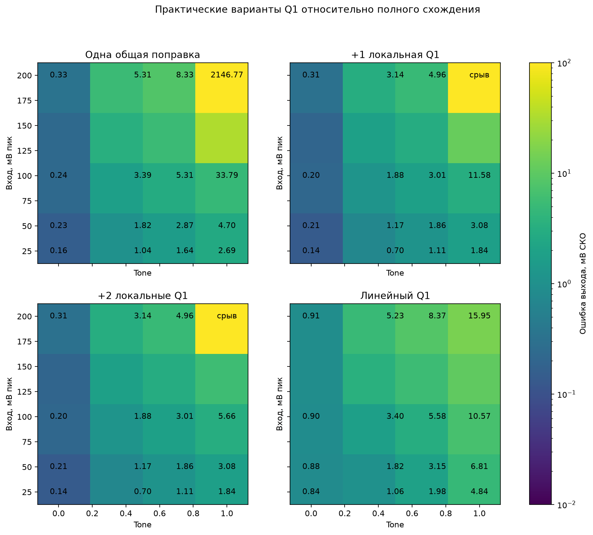
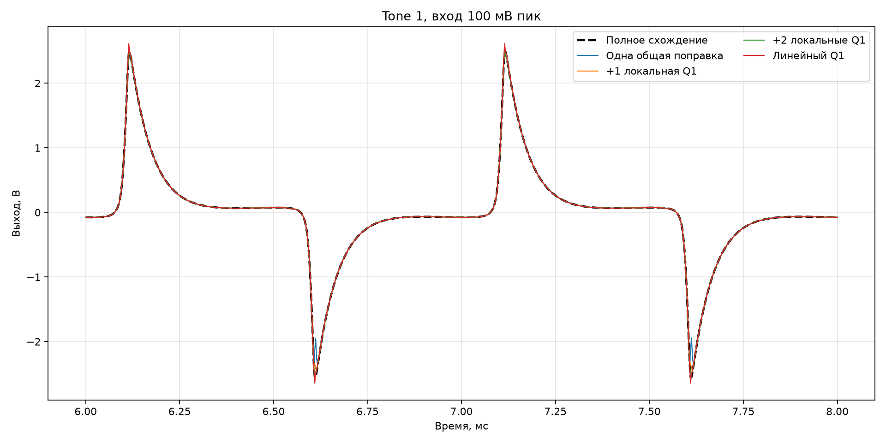

# Нелинейность выходного Q1

Сравнены одна общая поправка, одна и две дополнительные локальные поправки двух переменных
Q1 и линеаризация Q1. Эталон — полное схождение полной системы при 8×. Sustain и Volume
максимальны; проверены четыре положения Tone и вход 25, 50, 100 и 200 мВ пик.

Переход база–коллектор Q1 при Tone = 1 и входе 100 мВ достигает +0,457 В: Q1 входит в
насыщение, поэтому поправка только по переходу база–эмиттер была бы физически неверной.

## Вход 100 мВ пик

| Tone | Вариант | Ошибка, мВ СКО | Пиковая ошибка, мВ | Невязка, В |
|---:|---|---:|---:|---:|
| 0.00 | Одна общая поправка | 0.237 | 2.019 | 8.083e-02 |
| 0.00 | +1 локальная Q1 | 0.203 | 1.148 | 8.083e-02 |
| 0.00 | +2 локальные Q1 | 0.203 | 1.148 | 8.083e-02 |
| 0.00 | Линейный Q1 | 0.898 | 2.409 | 8.083e-02 |
| 0.50 | Одна общая поправка | 3.392 | 42.798 | 8.123e-02 |
| 0.50 | +1 локальная Q1 | 1.881 | 19.514 | 8.123e-02 |
| 0.50 | +2 локальные Q1 | 1.882 | 19.557 | 8.123e-02 |
| 0.50 | Линейный Q1 | 3.403 | 45.259 | 8.123e-02 |
| 0.75 | Одна общая поправка | 5.307 | 68.505 | 8.139e-02 |
| 0.75 | +1 локальная Q1 | 3.005 | 30.992 | 8.138e-02 |
| 0.75 | +2 локальные Q1 | 3.006 | 31.078 | 8.138e-02 |
| 0.75 | Линейный Q1 | 5.579 | 76.545 | 8.139e-02 |
| 1.00 | Одна общая поправка | 33.794 | 607.193 | 7.372e-01 |
| 1.00 | +1 локальная Q1 | 11.577 | 218.890 | 3.266e-01 |
| 1.00 | +2 локальные Q1 | 5.656 | 70.413 | 1.158e-01 |
| 1.00 | Линейный Q1 | 10.571 | 146.590 | 8.154e-02 |

## Tone = 1 по уровням входа

| Вход, мВ пик | Вариант | Ошибка, мВ СКО | Пиковая ошибка, мВ | Невязка, В |
|---:|---|---:|---:|---:|
| 25 | Одна общая поправка | 2.69 | 32.2 | 1.249e-02 |
| 25 | +1 локальная Q1 | 1.84 | 20.3 | 1.249e-02 |
| 25 | +2 локальные Q1 | 1.84 | 20.3 | 1.249e-02 |
| 25 | Линейный Q1 | 4.84 | 51.9 | 1.249e-02 |
| 50 | Одна общая поправка | 4.7 | 59.4 | 3.055e-02 |
| 50 | +1 локальная Q1 | 3.08 | 35.8 | 3.055e-02 |
| 50 | +2 локальные Q1 | 3.08 | 35.8 | 3.055e-02 |
| 50 | Линейный Q1 | 6.81 | 85.5 | 3.055e-02 |
| 100 | Одна общая поправка | 33.8 | 607 | 7.372e-01 |
| 100 | +1 локальная Q1 | 11.6 | 219 | 3.266e-01 |
| 100 | +2 локальные Q1 | 5.66 | 70.4 | 1.158e-01 |
| 100 | Линейный Q1 | 10.6 | 147 | 8.154e-02 |
| 200 | Одна общая поправка | 2.15e+03 | 4.92e+03 | 7.935e+30 |
| 200 | +1 локальная Q1 | 8.66e+26 | 1.03e+27 | 7.028e+30 |
| 200 | +2 локальные Q1 | 8.65e+26 | 1.03e+27 | 7.027e+30 |
| 200 | Линейный Q1 | 16 | 243 | 2.094e-01 |

## Вывод

До входа 100 мВ одна локальная двухпеременная поправка Q1 заметно помогает, две снижают ошибку
ещё сильнее. Но при 200 мВ и Tone = 1 все варианты с недосходившимся нелинейным Q1 срываются:
невязка достигает порядка 10^30. Даже фиксированные 2–10 общих поправок не восстанавливают
решение; около 15–20 уже сходятся, что неприемлемо для постоянного звукового пути.

Линеаризация Q1 остаётся ограниченной во всей проверенной сетке и при худшем режиме даёт
15,95 мВ СКО, но теряет физическое насыщение. Практический кандидат теперь адаптивный:
нелинейный Q1 с локальной поправкой в обычном режиме и переход на устойчивый линейный Q1 либо
на редкое полное восстановление при превышении порога невязки. Перед STM32 надо проверить
плавность такого перехода и затем измерить его стоимость.
