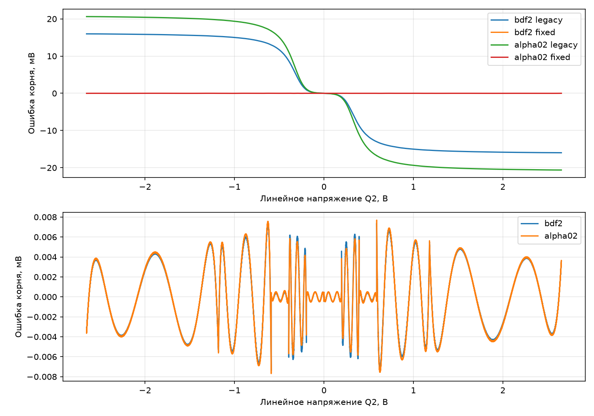
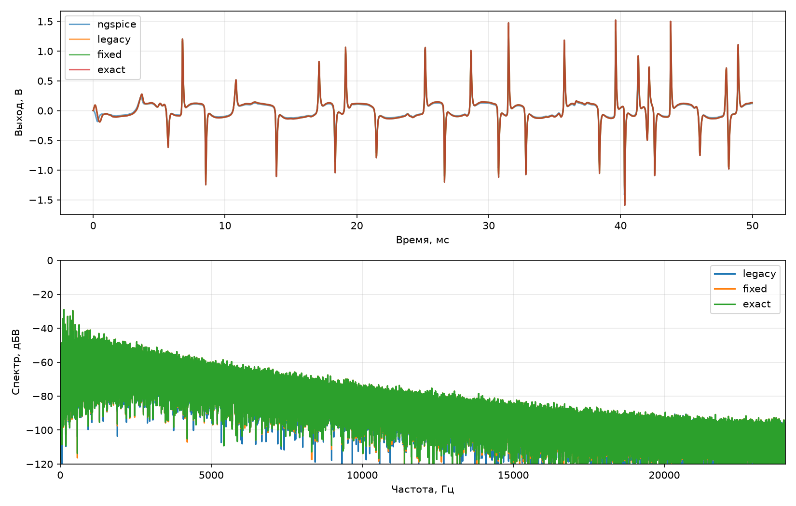

# Полином Q2 для выбранного интегратора

48 кГц; Sustain=1, Tone=1, Volume=0,8. C-ядро собрано GCC -O3 на компьютере.
legacy — прежний полином Эйлера; fixed — пять новых полиномов той же степени;
exact — прежний защищённый Ньютон для каждого Q2, контроль на компьютере.

## Локальная точность Q2

200001 точка в диапазоне −54…54 Vd; вычисление полинома выполняет C float.

| Метод | Вариант | Максимальная ошибка корня, мВ | Максимальная невязка, мВ |
|:---|:---|---:|---:|
| bdf2 | legacy | 15.969702 | 606.789730 |
| bdf2 | fixed | 0.007383 | 0.160904 |
| alpha02 | legacy | 20.611634 | 748.535754 |
| alpha02 | fixed | 0.007689 | 0.162489 |

## Ошибка выхода

Сигналы взяты до нормировки WAV. Удалены целая задержка (±24 отсчёта) и DC.
СКО и спектр сохраняют физический масштаб. Столбец формы дополнительно
исключает общий коэффициент усиления, найденный ПОСЛЕ выравнивания.
Атака: первые 120 мс отдельного e_major_attack; полный аккорд: e_major_dry, 4 с.
Эталон атак и синусов — полная модель Эйлера 16× с общим FIR;
полного аккорда 100 мВ — исходная таблица ngspice, без затухания и WAV-квантизации.

| Сигнал | Метод | Вариант | СКО, % | Форма, % | Спектр, дБ |
|:---|:---|:---|---:|---:|---:|
| attack_25mv | bdf2 | legacy | 7.2366 | 5.4171 | -24.9056 |
| attack_25mv | bdf2 | fixed | 4.6297 | 4.4673 | -29.2251 |
| attack_25mv | bdf2 | exact | 4.6672 | 4.5097 | -29.1526 |
| attack_25mv | alpha02 | legacy | 7.7862 | 5.8147 | -24.8852 |
| attack_25mv | alpha02 | fixed | 4.3005 | 4.2665 | -32.0096 |
| attack_25mv | alpha02 | exact | 4.2899 | 4.2557 | -32.0331 |
| attack_100mv | bdf2 | legacy | 8.8112 | 7.8897 | -23.4924 |
| attack_100mv | bdf2 | fixed | 7.2235 | 7.2125 | -25.1030 |
| attack_100mv | bdf2 | exact | 7.2282 | 7.2172 | -25.0951 |
| attack_100mv | alpha02 | legacy | 10.6217 | 10.0330 | -20.7783 |
| attack_100mv | alpha02 | fixed | 9.3318 | 9.2658 | -21.4422 |
| attack_100mv | alpha02 | exact | 9.3217 | 9.2560 | -21.4527 |
| full_100mv_spice | bdf2 | legacy | 14.4293 | 9.1956 | -18.8763 |
| full_100mv_spice | bdf2 | fixed | 18.8864 | 10.7447 | -16.1493 |
| full_100mv_spice | bdf2 | exact | 18.8887 | 10.7481 | -16.1491 |
| full_100mv_spice | alpha02 | legacy | 14.1621 | 9.3494 | -19.3062 |
| full_100mv_spice | alpha02 | fixed | 19.9224 | 11.3500 | -15.8059 |
| full_100mv_spice | alpha02 | exact | 19.9253 | 11.3530 | -15.8048 |
| sine_440_5mv | bdf2 | legacy | 7.7779 | 5.8341 | -24.7913 |
| sine_440_5mv | bdf2 | fixed | 4.6165 | 4.3552 | -30.3945 |
| sine_440_5mv | bdf2 | exact | 4.6073 | 4.3456 | -30.4012 |
| sine_440_5mv | alpha02 | legacy | 8.6623 | 6.5694 | -24.5429 |
| sine_440_5mv | alpha02 | fixed | 4.3181 | 4.2018 | -36.5017 |
| sine_440_5mv | alpha02 | exact | 4.3200 | 4.2039 | -36.5038 |
| sine_440_25mv | bdf2 | legacy | 8.2223 | 7.0564 | -24.9824 |
| sine_440_25mv | bdf2 | fixed | 5.9035 | 5.8599 | -28.5194 |
| sine_440_25mv | bdf2 | exact | 5.9060 | 5.8625 | -28.5208 |
| sine_440_25mv | alpha02 | legacy | 7.6079 | 6.4694 | -26.0911 |
| sine_440_25mv | alpha02 | fixed | 4.9672 | 4.9322 | -30.9735 |
| sine_440_25mv | alpha02 | exact | 4.9672 | 4.9321 | -30.9778 |
| sine_440_100mv | bdf2 | legacy | 9.6269 | 9.0834 | -22.9382 |
| sine_440_100mv | bdf2 | fixed | 8.4014 | 8.3978 | -24.0930 |
| sine_440_100mv | bdf2 | exact | 8.4014 | 8.3977 | -24.0925 |
| sine_440_100mv | alpha02 | legacy | 10.0390 | 9.8785 | -20.9275 |
| sine_440_100mv | alpha02 | fixed | 9.9251 | 9.5251 | -20.8146 |
| sine_440_100mv | alpha02 | exact | 9.9247 | 9.5248 | -20.8151 |
| sine_1000_5mv | bdf2 | legacy | 6.5508 | 4.7286 | -25.2943 |
| sine_1000_5mv | bdf2 | fixed | 4.0017 | 3.8786 | -29.4233 |
| sine_1000_5mv | bdf2 | exact | 4.0004 | 3.8771 | -29.4220 |
| sine_1000_5mv | alpha02 | legacy | 6.7291 | 4.7365 | -25.8593 |
| sine_1000_5mv | alpha02 | fixed | 3.2312 | 3.2280 | -36.2713 |
| sine_1000_5mv | alpha02 | exact | 3.2296 | 3.2264 | -36.2796 |
| sine_1000_25mv | bdf2 | legacy | 8.0542 | 7.0894 | -24.9171 |
| sine_1000_25mv | bdf2 | fixed | 6.1178 | 6.1076 | -28.0707 |
| sine_1000_25mv | bdf2 | exact | 6.1173 | 6.1071 | -28.0705 |
| sine_1000_25mv | alpha02 | legacy | 8.1298 | 7.7757 | -24.9967 |
| sine_1000_25mv | alpha02 | fixed | 7.4976 | 7.1434 | -24.7172 |
| sine_1000_25mv | alpha02 | exact | 7.4971 | 7.1427 | -24.7165 |
| sine_1000_100mv | bdf2 | legacy | СРЫВ | — | — |
| sine_1000_100mv | bdf2 | fixed | СРЫВ | — | — |
| sine_1000_100mv | bdf2 | exact | СРЫВ | — | — |
| sine_1000_100mv | alpha02 | legacy | СРЫВ | — | — |
| sine_1000_100mv | alpha02 | fixed | СРЫВ | — | — |
| sine_1000_100mv | alpha02 | exact | СРЫВ | — | — |
| sine_3000_5mv | bdf2 | legacy | 7.0552 | 5.2095 | -24.1527 |
| sine_3000_5mv | bdf2 | fixed | 7.1353 | 7.0399 | -26.7946 |
| sine_3000_5mv | bdf2 | exact | 7.1345 | 7.0391 | -26.7966 |
| sine_3000_5mv | alpha02 | legacy | 4.9417 | 2.8012 | -27.5514 |
| sine_3000_5mv | alpha02 | fixed | 4.8909 | 4.8590 | -36.5411 |
| sine_3000_5mv | alpha02 | exact | 4.8911 | 4.8592 | -36.5424 |
| sine_3000_25mv | bdf2 | legacy | 7.8258 | 7.3800 | -26.6243 |
| sine_3000_25mv | bdf2 | fixed | 6.4738 | 6.4108 | -28.9244 |
| sine_3000_25mv | bdf2 | exact | 6.4733 | 6.4102 | -28.9247 |
| sine_3000_25mv | alpha02 | legacy | 9.2881 | 9.2803 | -26.4559 |
| sine_3000_25mv | alpha02 | fixed | 9.4445 | 8.4297 | -23.9523 |
| sine_3000_25mv | alpha02 | exact | 9.4445 | 8.4295 | -23.9521 |
| sine_3000_100mv | bdf2 | legacy | СРЫВ | — | — |
| sine_3000_100mv | bdf2 | fixed | СРЫВ | — | — |
| sine_3000_100mv | bdf2 | exact | СРЫВ | — | — |
| sine_3000_100mv | alpha02 | legacy | СРЫВ | — | — |
| sine_3000_100mv | alpha02 | fixed | СРЫВ | — | — |
| sine_3000_100mv | alpha02 | exact | СРЫВ | — | — |
| sine_6000_5mv | bdf2 | legacy | 35.9627 | 3.2790 | -8.8584 |
| sine_6000_5mv | bdf2 | fixed | 35.9073 | 3.6732 | -8.8710 |
| sine_6000_5mv | bdf2 | exact | 35.9072 | 3.6734 | -8.8711 |
| sine_6000_5mv | alpha02 | legacy | 25.3275 | 9.9967 | -12.4382 |
| sine_6000_5mv | alpha02 | fixed | 25.3442 | 10.4129 | -12.4710 |
| sine_6000_5mv | alpha02 | exact | 25.3444 | 10.4129 | -12.4712 |
| sine_6000_25mv | bdf2 | legacy | 23.0096 | 18.7785 | -15.5533 |
| sine_6000_25mv | bdf2 | fixed | 24.2450 | 21.9340 | -16.4655 |
| sine_6000_25mv | bdf2 | exact | 24.2465 | 21.9359 | -16.4655 |
| sine_6000_25mv | alpha02 | legacy | 19.0539 | 18.0677 | -20.4559 |
| sine_6000_25mv | alpha02 | fixed | 22.3700 | 22.3185 | -21.7476 |
| sine_6000_25mv | alpha02 | exact | 22.3692 | 22.3177 | -21.7483 |
| sine_6000_100mv | bdf2 | legacy | СРЫВ | — | — |
| sine_6000_100mv | bdf2 | fixed | СРЫВ | — | — |
| sine_6000_100mv | bdf2 | exact | СРЫВ | — | — |
| sine_6000_100mv | alpha02 | legacy | СРЫВ | — | — |
| sine_6000_100mv | alpha02 | fixed | СРЫВ | — | — |
| sine_6000_100mv | alpha02 | exact | СРЫВ | — | — |

## Отличие от точного Q2 того же C-ядра

Без выравнивания, удаления DC и подгонки усиления; СКО в мВ.

| Сигнал | Метод | Вариант | СКО, мВ |
|:---|:---|:---|---:|
| attack_25mv | bdf2 | legacy | 9.419085 |
| attack_25mv | bdf2 | fixed | 0.779400 |
| attack_25mv | alpha02 | legacy | 12.340427 |
| attack_25mv | alpha02 | fixed | 0.703794 |
| attack_100mv | bdf2 | legacy | 10.539958 |
| attack_100mv | bdf2 | fixed | 0.050576 |
| attack_100mv | alpha02 | legacy | 14.019200 |
| attack_100mv | alpha02 | fixed | 0.069735 |
| full_100mv_spice | bdf2 | legacy | 8.978844 |
| full_100mv_spice | bdf2 | fixed | 0.409393 |
| full_100mv_spice | alpha02 | legacy | 11.834417 |
| full_100mv_spice | alpha02 | fixed | 0.382157 |
| sine_440_5mv | bdf2 | legacy | 10.362626 |
| sine_440_5mv | bdf2 | fixed | 0.142055 |
| sine_440_5mv | alpha02 | legacy | 13.641078 |
| sine_440_5mv | alpha02 | fixed | 0.213137 |
| sine_440_25mv | bdf2 | legacy | 12.090734 |
| sine_440_25mv | bdf2 | fixed | 0.045146 |
| sine_440_25mv | alpha02 | legacy | 16.094542 |
| sine_440_25mv | alpha02 | fixed | 0.044322 |
| sine_440_100mv | bdf2 | legacy | 12.802852 |
| sine_440_100mv | bdf2 | fixed | 0.025123 |
| sine_440_100mv | alpha02 | legacy | 17.145207 |
| sine_440_100mv | alpha02 | fixed | 0.022567 |
| sine_1000_5mv | bdf2 | legacy | 17.185928 |
| sine_1000_5mv | bdf2 | fixed | 0.140768 |
| sine_1000_5mv | alpha02 | legacy | 22.917031 |
| sine_1000_5mv | alpha02 | fixed | 0.102617 |
| sine_1000_25mv | bdf2 | legacy | 19.378146 |
| sine_1000_25mv | bdf2 | fixed | 0.039192 |
| sine_1000_25mv | alpha02 | legacy | 25.580296 |
| sine_1000_25mv | alpha02 | fixed | 0.035097 |
| sine_3000_5mv | bdf2 | legacy | 27.152003 |
| sine_3000_5mv | bdf2 | fixed | 0.207274 |
| sine_3000_5mv | alpha02 | legacy | 36.142216 |
| sine_3000_5mv | alpha02 | fixed | 0.174890 |
| sine_3000_25mv | bdf2 | legacy | 33.246337 |
| sine_3000_25mv | bdf2 | fixed | 0.045683 |
| sine_3000_25mv | alpha02 | legacy | 43.650322 |
| sine_3000_25mv | alpha02 | fixed | 0.047954 |
| sine_6000_5mv | bdf2 | legacy | 0.948009 |
| sine_6000_5mv | bdf2 | fixed | 0.234300 |
| sine_6000_5mv | alpha02 | legacy | 1.388043 |
| sine_6000_5mv | alpha02 | fixed | 0.268260 |
| sine_6000_25mv | bdf2 | legacy | 31.498997 |
| sine_6000_25mv | bdf2 | fixed | 0.122246 |
| sine_6000_25mv | alpha02 | legacy | 47.654665 |
| sine_6000_25mv | alpha02 | fixed | 0.166996 |

## Устойчивость полного аккорда

| Вход, мВ | Метод | Вариант | Первый плохой отсчёт (0 = нет) | Удержания | Пик, В |
|---:|:---|:---|---:|---:|---:|
| 25 | bdf2 | legacy | 0 | 0 | 1.228034 |
| 25 | bdf2 | fixed | 0 | 0 | 1.284686 |
| 25 | bdf2 | exact | 0 | 0 | 1.284780 |
| 25 | alpha02 | legacy | 0 | 0 | 1.295406 |
| 25 | alpha02 | fixed | 0 | 0 | 1.379310 |
| 25 | alpha02 | exact | 0 | 0 | 1.379306 |
| 50 | bdf2 | legacy | 191664 | 0 | nan |
| 50 | bdf2 | fixed | 191662 | 0 | nan |
| 50 | bdf2 | exact | 191662 | 0 | nan |
| 50 | alpha02 | legacy | 0 | 0 | 1.523236 |
| 50 | alpha02 | fixed | 191663 | 0 | nan |
| 50 | alpha02 | exact | 191663 | 0 | nan |
| 100 | bdf2 | legacy | 0 | 0 | 1.525807 |
| 100 | bdf2 | fixed | 0 | 0 | 1.591268 |
| 100 | bdf2 | exact | 0 | 0 | 1.591312 |
| 100 | alpha02 | legacy | 0 | 0 | 1.692287 |
| 100 | alpha02 | fixed | 0 | 0 | 1.793543 |
| 100 | alpha02 | exact | 0 | 0 | 1.793538 |
| 200 | bdf2 | legacy | 2107 | 0 | nan |
| 200 | bdf2 | fixed | 2107 | 0 | nan |
| 200 | bdf2 | exact | 2107 | 0 | nan |
| 200 | alpha02 | legacy | 1940 | 0 | nan |
| 200 | alpha02 | fixed | 1940 | 0 | nan |
| 200 | alpha02 | exact | 1940 | 0 | nan |

Прослушивание, единый масштаб:

- [Прежний BDF2](bdf2_legacy_100mv.wav)
- [Исправленный полином](bdf2_fixed_100mv.wav)
- [Точный Q2](bdf2_exact_100mv.wav)

Воспроизведение: `python simulation/run_q2_polynomial_validation.py`.
Сырые результаты и временные сборки: `simulation/raw/q2_polynomial/`.
Новые аппаратные такты этим опытом не измеряются.

## Вывод и статус

Полином исправляет локальную несогласованность интегратора. На коротких атаках
относительно полной модели Эйлера 16× ошибка уменьшается. На полном аккорде
100 мВ относительно ngspice ошибка увеличивается; точный Q2 даёт почти тот же
результат, что новый полином. Значит, дальнейшее уточнение полинома этот
разрыв не устранит. Причина остаточного расхождения всего тракта этим опытом
не установлена; возможная компенсация ошибок требует отдельной проверки.

Рабочая сборка сохраняет прежний полином. Новый включается только макросом
`COMPOSED_Q2_MATCHED`; отдельный стенд — `composed_bdf2_q2_block_benchmark`.
Сетка полного аккорда обнаружила срывы BDF2 на 50 и 200 мВ и до исправления.
При наличии срыва исправленного BDF2 программа завершится ненулевым кодом,
предварительно сохранив все результаты. Это отрицательный итог общей проверки,
а не потеря отчёта.

Пять интервалов, степень 5 и структура Горнера сохранены. Локальная цена
полинома должна остаться близкой, но цена всего блока может измениться из-за
другой траектории и числа уточнений Tone–Q1. Нулевую доплату по времени всего
тракта без нового аппаратного измерения заявлять нельзя.

Этот опыт использует отдельную 120-мс атаку и полный четырёхсекундный файл
явно раздельно. Проценты формы рассчитаны после выравнивания, в отличие от
некоторых прежних программ, подбиравших масштаб до него. Для будущего
сравнения использовать одинаковый вход и исходный эталон в вольтах.
