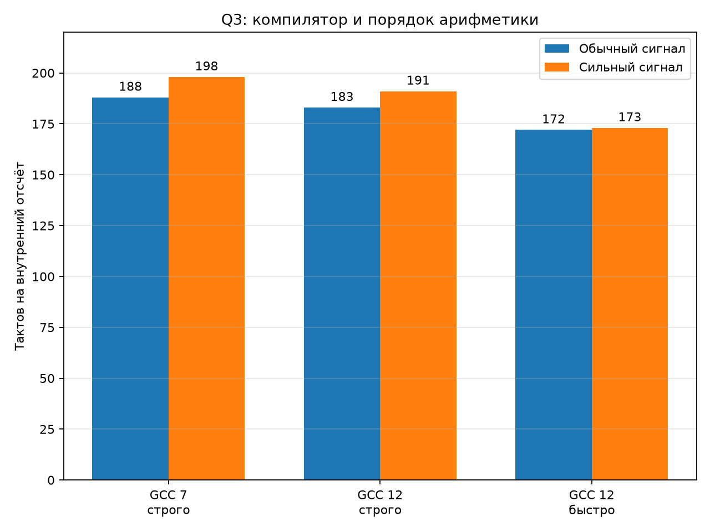

# Q3: проверка машинного кода и компилятора

## Правильная граница измерения

Чтение DWT вокруг каждой встроенной поправки оказалось недостаточной границей
для нового компилятора: чистая арифметика могла переноситься через метку. После
замены меток невстраиваемыми функциями цена одного шага выросла с ошибочных 65
до 143 тактов. Такой способ, в свою очередь, мешает удерживать состояние между
отсчётами.

Итоговый замер охватывает целый блок из 768 шагов одной
парой жёстких меток. Это соответствует будущему обработчику звукового блока и
не создаёт границу вызова на каждом отсчёте. Конечные состояния блочного и
поотсчётного вариантов совпали побитно.

| Сборка | Обычный сигнал | Сильный сигнал |
|---|---:|---:|
| GCC 7.2.1, строгая арифметика | 188 | 198 |
| GCC 12.3.1, строгая арифметика | 183 | 191 |
| GCC 12.3.1, `fast-math` | 172 | 173 |

## Что показал машинный код

Главный выигрыш создаёт не отдельная команда, а отсутствие границы между
отсчётами: состояние и часть констант остаются в регистрах FPU. GCC 12 в строгом
режиме экономит ещё 5–7 тактов относительно GCC 7. Ручное удаление трёх записей
и трёх чтений линейной части оказалось регрессией из-за давления на регистры:
ядро подорожало со 129 до 143 тактов, сильный поток — с 302 до 311.

Разрешение переупорядочивать суммы и произведения даёт ещё
11–18 тактов. При этом
конечное состояние изменилось на 1–15 единиц младшего разряда `float`, поэтому
этот режим пока остаётся исследовательской верхней границей, а не основным.

Два строгих Q3 требуют 366–382 тактов из
бюджета 442,7 такта при 8×. На остальную педаль остаётся примерно
60.7–76.7 такта.

## Вывод

Ручной ассемблер имеет смысл только для локального получения оставшихся
примерно 11–18 тактов: длинных цепочек умножений и сложений, деления Ньютона и
обслуживания двух обращений к CORDIC. Переписывать всё ядро на ассемблере сейчас
невыгодно. Основной вариант — GCC 12, строгая арифметика и блочная обработка;
агрессивную арифметику сначала надо сравнить с эталоном на длинных сигналах.
