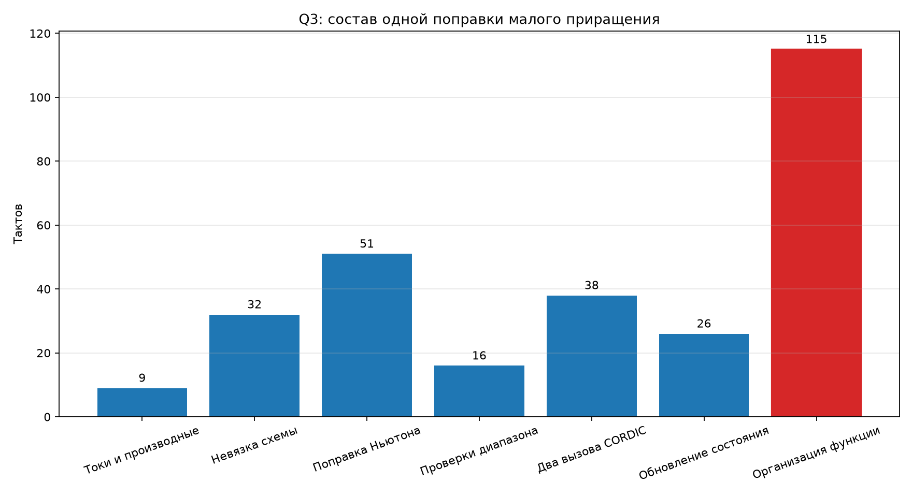
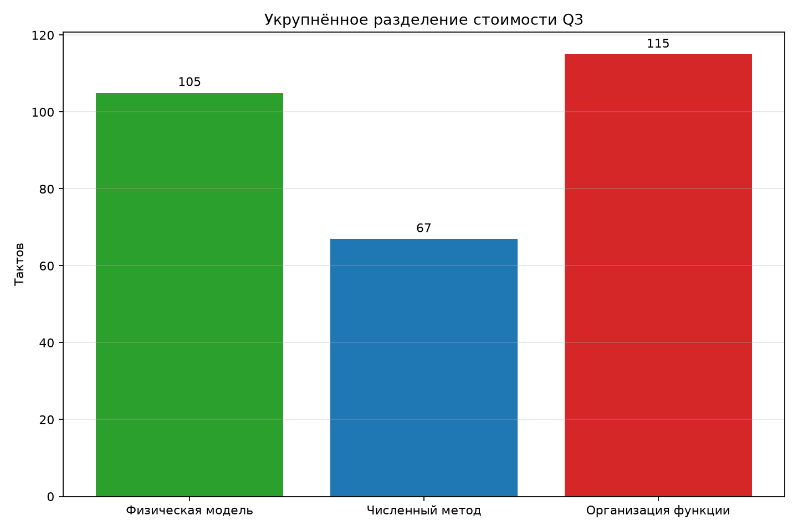

# Q3: разделение физики и арифметики

## Метод

Внутри одной поправки расставлены метки счётчика DWT. Цена пары меток —
1 такт — вычтена из каждого участка. Выполнено
1000 повторений; второй запуск дал те же значения.

Полная изолированная поправка измерена отдельно и занимает **287 тактов**.
Размеченные участки суммарно дали 172 такта. Остаток 115 тактов
выделен отдельной строкой.

| Участок | Тактов | Доля полной функции |
|---|---:|---:|
| Токи и производные | 9 | 3.1% |
| Невязка схемы | 32 | 11.1% |
| Поправка Ньютона | 51 | 17.8% |
| Проверки диапазона | 16 | 5.6% |
| Два вызова CORDIC | 38 | 13.2% |
| Обновление состояния | 26 | 9.1% |
| Организация функции | 115 | 40.1% |

## Укрупнённое разделение

- физические токи, топология, CORDIC и нелинейное состояние — 105 тактов;
- поправка Ньютона и проверки — 67 тактов;
- организация скомпилированной функции — 115 тактов.

## Что входит в остаток

Остаток нельзя трактовать как одну инструкцию. Размеченный цикл позволяет
компилятору удерживать часть констант между повторениями, тогда как настоящая
функция вызывается заново. В её машинном коде видны сохранение двенадцати
регистров FPU, загрузки состояния и многочисленных констант, возврат регистров,
ветвления и более тяжёлое распределение временных значений.

Поэтому 115 тактов — это верхнеуровневая цена формы горячей функции и
движения данных, а не точная стоимость только памяти. Для следующего шага надо
сравнить нынешнюю функцию с вариантом, встроенным непосредственно в цикл
обработки, где константы и часть состояния смогут оставаться в регистрах.

## Вывод

Физику преждевременно резать. Непосредственные физические вычисления занимают
около 36.6% полной функции, а Ньютон с проверками —
23.3%. Наибольшая отдельная категория — организация
скомпилированного ядра, 40.1%. Следующий опыт должен
проверять встраивание и уплотнение данных, не меняя уравнения схемы.
