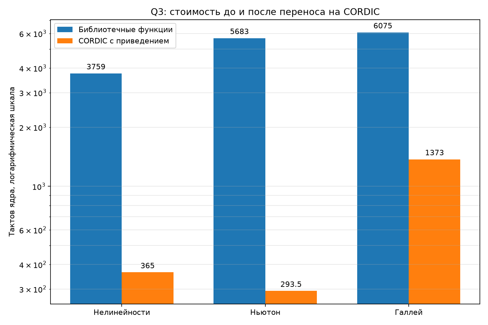
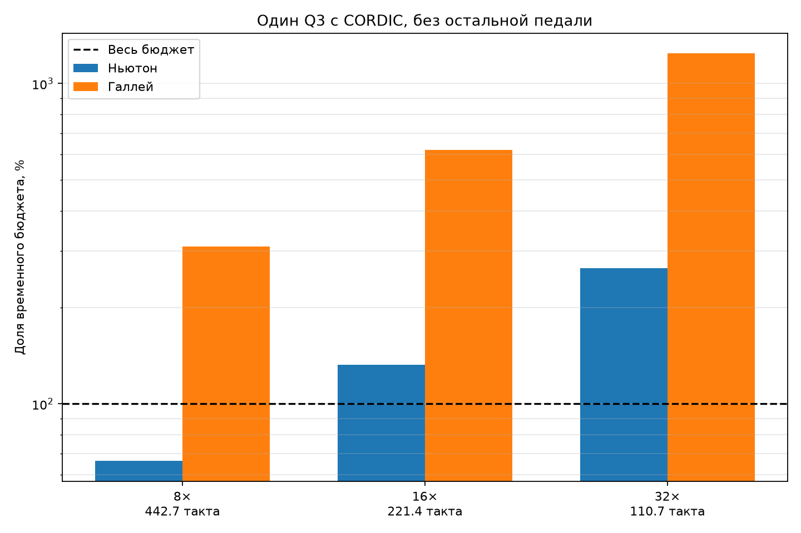

# Такты полной поправки Q3 на STM32G474RE

## Цель и условия

Измерена трёхмерная поправка Q3 до упрощения физики. Плата NUCLEO-G474RE,
ядро 170 МГц, GCC 7.2.1, `-O3`, FPv4-SP-D16. Счётчик DWT, по 1000
вызовов, вычтены 8 тактов пустого вызова. Матрица 3×3 решается
развёрнутой формулой. Ввод-вывод, FMAC и остальные каскады не входят.

## Приведение аргумента

Для каждой экспоненты используется

$$x=k\ln 2+r,\qquad k=\operatorname{round}(x/\ln 2),\qquad |r|\leq\ln2/2.$$

CORDIC считает `cosh(r)` и `sinh(r)`, затем

$$e^x=2^k(\cosh r+\sinh r),\qquad e^{-x}=2^{-k}(\cosh r-\sinh r).$$

Так аргументы исходной модели до примерно 24,4 превращаются в остаток
не более 0,347, что заведомо внутри границы 1,118 из [ST AN5325](https://www.st.com/resource/en/application_note/an5325-how-to-use-the-cordic-to-perform-mathematical-functions-on-stm32-mcus-stmicroelectronics.pdf).

## Специализация Ньютона

В горячем пути убраны указатель на функцию, массивы, циклы, деления на постоянные
масштабы и вторые производные. Если обратная экспонента после масштабирования всё равно
округляется до нуля в `float`, вызов CORDIC пропускается. При нулевой производной обратного
перехода система 3×3 точно распадается на систему 2×2 и одно обратное вычисление. В измеренной
точке три новых значения \(q\) побитно совпали с общим вариантом.

## Обновление по малому приращению

Между отсчётами хранятся \(E=e^x\), \(S=\sinh y\) и \(C=\cosh y\).
После ньютоновской поправки CORDIC получает непосредственно \(\Delta x\) и
\(\Delta y\); состояние обновляется по формулам сложения гиперболических функций.
Проверка диапазона выполняется в каждом вызове. Раз в 32
отсчёта состояние полностью восстанавливается по абсолютным аргументам.

## Измеренные такты

| Часть | Библиотечные функции | CORDIC | Ускорение |
|---|---:|---:|---:|
| Нелинейные токи и производные | 3759 | 365 | 10.30× |
| Одна поправка Ньютона | 5683 | 1028 | 5.53× |
| Специализированная поправка Ньютона | 5683 | 598 | 9.50× |
| Малое приращение с учётом восстановления | 5683 | 293.5 | 19.36× |
| Одна поправка Галлея | 6075 | 1373 | 4.42× |

Отдельно: нелинейности вместе со сборкой невязки и матрицы —
539 тактов; решение 3×3 — 70 такта; один вызов CORDIC
`cosh+sinh` — 20 такта.

## Точность в рабочей точке

| Величина | `libm` | CORDIC | Абс. ошибка | Отн. ошибка |
|---|---:|---:|---:|---:|
| Ток база–эмиттер | 3.98982200e-04 | 3.98982549e-04 | 3.492e-10 | 8.753e-07 |
| Обратный ток база–коллектор | -1.19999996e-14 | -1.19999996e-14 | 0.000e+00 | 0.000e+00 |
| Ток диодной пары | -3.34769061e-06 | -3.34768720e-06 | 3.411e-12 | 1.019e-06 |
| Производная тока база–эмиттер | 1.54256234e-02 | 1.54256374e-02 | 1.397e-08 | 9.056e-07 |
| Производная обратного тока | 0.00000000e+00 | 0.00000000e+00 | 0.000e+00 | 0.000e+00 |
| Производная тока диодов | 6.81210367e-05 | 6.81209713e-05 | 6.548e-11 | 9.613e-07 |
| Вторая производная тока база–эмиттер | 5.96392155e-01 | 5.96392691e-01 | 5.364e-07 | 8.995e-07 |
| Вторая производная обратного тока | 0.00000000e+00 | 0.00000000e+00 | 0.000e+00 | 0.000e+00 |
| Вторая производная тока диодов | -1.38617016e-03 | -1.38616876e-03 | 1.397e-09 | 1.008e-06 |

Максимальная относительная ошибка ненулевых величин: 1.019e-06.
Для аргумента 0,75 CORDIC вернул `cosh=1.294683218` и
`sinh=0.822316170`.

## Сравнение с бюджетом

| Повышение | Частота, Гц | Бюджет, тактов | Ньютон, % | Галлей, % |
|---:|---:|---:|---:|---:|
| 8× | 384000 | 442.7 | 66.3 | 310.1 |
| 16× | 768000 | 221.4 | 132.6 | 620.3 |
| 32× | 1536000 | 110.7 | 265.2 | 1240.5 |

## Вывод

Приведение аргумента решает задачу диапазона и даёт около шести значащих
цифр совпадения с `libm`. Малое приращение вместе с проверкой диапазона и
амортизированным восстановлением занимает 66.3% бюджета 8×.
Один Q3 помещается, но два таких каскада уже требуют около
587.0 такта. Следующий крупный резерв — одно общее
приближение вместо двух вызовов CORDIC либо разные частоты расчёта каскадов.
