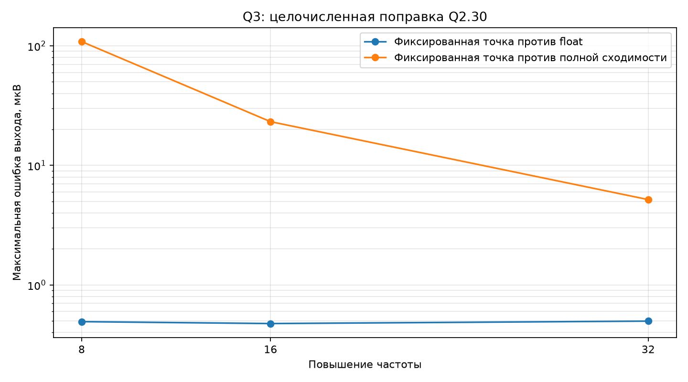

# Фиксированная точка для ядра Ньютона Q3

## Цель

Проверить, можно ли представить сокращённое ядро Q3 в 32-разрядных целых
числах без неприемлемой ошибки.

## Масштабирование

Один общий Q-формат непригоден: в модели одновременно есть токи порядка
\(10^{-14}\) А, напряжения в вольтах и элементы якобиана до 78.

Использованы:

- отклонения нелинейных напряжений от рабочей точки — Q2.30;
- токи сначала умножаются на масштаб своего столбца матрицы, затем хранятся в Q2.30;
- нормированная матрица влияния — Q2.30;
- якобиан — Q9.23;
- решение 3×3 — целочисленный метод Гаусса с 64-разрядными промежуточными результатами.

## Точность

| Частота | Целые против float, мкВ | Целые против полной сходимости, мкВ | Float против полной сходимости, мкВ | Невязка, А | Занято Q2.30 |
|---:|---:|---:|---:|---:|---:|
| 8× | 0.493 | 108.557 | 108.765 | 4.015e-07 | 18.2% |
| 16× | 0.475 | 23.226 | 23.502 | 6.736e-08 | 18.2% |
| 32× | 0.498 | 5.175 | 5.422 | 1.169e-08 | 18.2% |

### Проверка уровня в 16×

| Амплитуда входа, В | Целые против float, мкВ | Занято Q2.30 |
|---:|---:|---:|
| 0.05 | 0.475 | 18.2% |
| 0.50 | 0.266 | 24.8% |
| 1.00 | 0.161 | 32.1% |

## Измерение STM32

Решение одной и той же системы 3×3:

- аппаратная плавающая точка с развёрнутой формулой — **72 такта**;
- целочисленный метод Гаусса с 64-разрядными делениями — **1343 такта**.

## Вывод

По точности раздельные форматы работают. Но полная замена `float` на целые числа в
текущей системе 3×3 не даёт ускорения: Cortex-M4 не имеет аппаратного 64-разрядного
деления, а FPU решает эту малую систему очень дёшево. Разумный путь — оставить
решение матрицы в `float`, а целые форматы пробовать для FMAC, CORDIC и хранения состояний.
