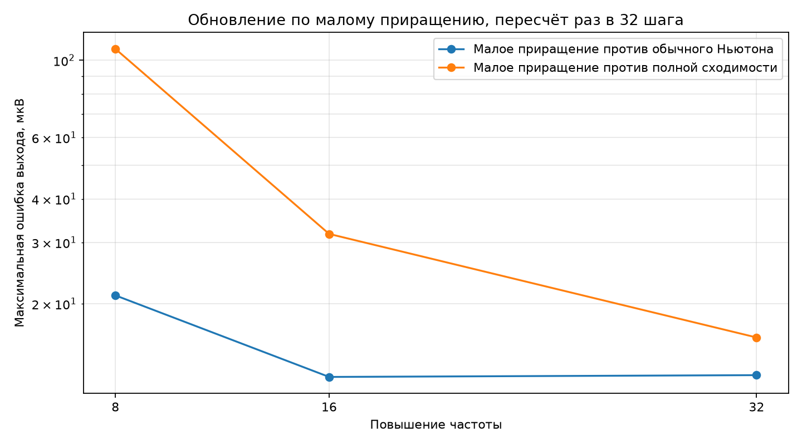
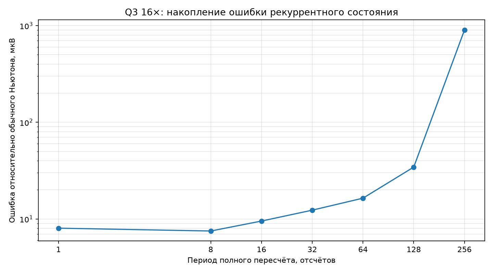

# Q3: обновление нелинейностей по малому приращению

## Метод

В состоянии хранятся
экспонента \(E=e^{v_{BE}/V_T}\) и пара
\(S=\sinh(v_D/nV_T)\), \(C=\cosh(v_D/nV_T)\). После поправки
\(\Delta v\) они обновляются как

\[
E_{k+1}=E_k\left(\cosh\Delta z+\sinh\Delta z\right),
\qquad \Delta z=\frac{\Delta v_{BE}}{V_T},
\]

\[
S_{k+1}=S_k\cosh\Delta d+C_k\sinh\Delta d,
\qquad
C_{k+1}=C_k\cosh\Delta d+S_k\sinh\Delta d.
\]

CORDIC получает малое приращение напрямую, без разложения \(k\ln2+r\),
масштабирования экспоненты и пересборки всего якобиана. Раз в
32 шага сохранённое состояние полностью пересчитывается. Если приращение выходит за прямой
диапазон CORDIC, полный пересчёт выполняется немедленно.

## Точность

Синус 1 кГц, 50 мВ, 5 мс. Эмулятор округляет входы и выходы CORDIC до Q1.31,
но не воспроизводит внутреннюю ошибку его итераций.

| Частота | Против обычного Ньютона, мкВ | Против полной сходимости, мкВ | Обычный Ньютон против полной сходимости, мкВ | Ошибка сохранённого состояния | Макс. \(|\Delta BE|\) | Макс. \(|\Delta D|\) | Аварийных пересчётов |
|---:|---:|---:|---:|---:|---:|---:|---:|
| 8× | 21.140 | 107.793 | 108.765 | 5.963e-05 | 0.0029 | 0.2306 | 0 |
| 16× | 12.333 | 31.731 | 23.502 | 1.788e-05 | 0.0015 | 0.1156 | 0 |
| 32× | 12.478 | 16.006 | 5.422 | 2.076e-06 | 0.0007 | 0.0579 | 0 |

### Период пересчёта при 16×

| Период | Ошибка выхода, мкВ | Ошибка сохранённого состояния |
|---:|---:|---:|
| 1 | 8.032 | 0.000e+00 |
| 8 | 7.506 | 1.114e-06 |
| 16 | 9.516 | 1.502e-06 |
| 32 | 12.333 | 1.788e-05 |
| 64 | 16.414 | 1.568e-04 |
| 128 | 34.400 | 5.843e-04 |
| 256 | 901.930 | 2.543e-01 |

### Сильный вход

| Вход, В | Частота | Макс. \(|\Delta BE|\) | Макс. \(|\Delta D|\) | Аварийных пересчётов |
|---:|---:|---:|---:|---:|
| 0.05 | 8× | 0.0029 | 0.2306 | 0 |
| 0.05 | 16× | 0.0015 | 0.1156 | 0 |
| 0.05 | 32× | 0.0007 | 0.0579 | 0 |
| 0.50 | 8× | 0.0165 | 1.1666 | 50 |
| 0.50 | 16× | 0.0083 | 0.5842 | 0 |
| 0.50 | 32× | 0.0042 | 0.2933 | 0 |
| 1.00 | 8× | 0.0267 | 1.7849 | 48 |
| 1.00 | 16× | 0.0134 | 0.8933 | 46 |
| 1.00 | 32× | 0.0067 | 0.4482 | 0 |

## Изолированный замер тактов STM32G474RE

- поправка с двумя прямыми обновлениями CORDIC — **288 такта**;
- полный пересчёт двух нелинейных состояний — **176 тактов**;
- средняя цена при периоде 32 — **293.5 такта**.

Это расчётная сумма изолированных вызовов, без счётчика периода и выбора
режима. Длительный потоковый опыт дал 371 такт на обычном входе и 392 такта
при автоматическом периоде на сильном входе; см.
[`q3_stream_benchmark/report.md`](../q3_stream_benchmark/report.md).

| Частота | Бюджет, тактов | Цена Q3, тактов | Доля бюджета |
|---:|---:|---:|---:|
| 8× | 442.7 | 293.5 | 66.3% |
| 16× | 221.4 | 293.5 | 132.6% |
| 32× | 110.7 | 293.5 | 265.2% |

## Вывод

По изолированной оценке один Q3 помещается в 8× с запасом около 149.2 такта. Два одинаковых каскада
потребуют около 587.0 такта, поэтому вся педаль в 8× пока не помещается. Следующие
резервы: одно общее полиномиальное обновление вместо двух вызовов CORDIC, упрощение транзистора
или разные частоты для двух каскадов.
