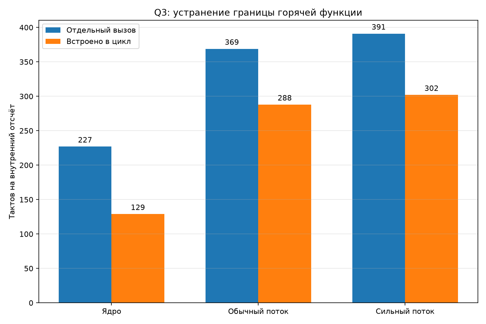

# Q3: встраивание горячего ядра в цикл

## Метод

Сравнены два машинно равнозначных варианта одной поправки: отдельный вызов
функции и тот же исходный код, принудительно встроенный в цикл. Оба варианта
обработали одну и ту же последовательность. Все три переменные схемы и три
сохранённые нелинейные величины совпали побитно.

| Режим | Отдельный вызов | Встроенное ядро | Экономия |
|---|---:|---:|---:|
| Только ядро | 227 | 129 | 98 |
| Обычный поток | 369 | 288 | 81 |
| Сильный поток, автоматическое восстановление | 391 | 302 | 89 |

## Разбор

В отдельном опыте ядро ускорилось на
43.2%. Компилятор смог
сохранить состояние и константы между соседними шагами и перестал на каждом
отсчёте сохранять и восстанавливать большой набор регистров FPU.

В полном обычном потоке выигрыш составил 81
такт. Если сопоставить его с прежним нераспределённым остатком 115
тактов, после встраивания остаётся около 34 тактов. Остаток
сократился в 3.38 раза. Это оценка по разности
полных потоков, а не новое пооперационное разложение.

При 170 МГц бюджет одного внутреннего отсчёта для 8-кратной частоты равен
442,7 такта. Один полный Q3 теперь занимает около
65.1% этого бюджета, два одинаковых каскада —
около 130.1%. Для двух каскадов всё ещё требуется
снизить среднюю цену одного примерно до 221 такта.

## Вывод

Цель сократить организационный остаток втрое достигнута без изменения
уравнений и без численного расхождения. Встраивание следует считать основной
формой будущего звукового цикла. Следующий крупный резерв уже находится в
физической модели и частоте расчёта, а не в границе вызова функции.
