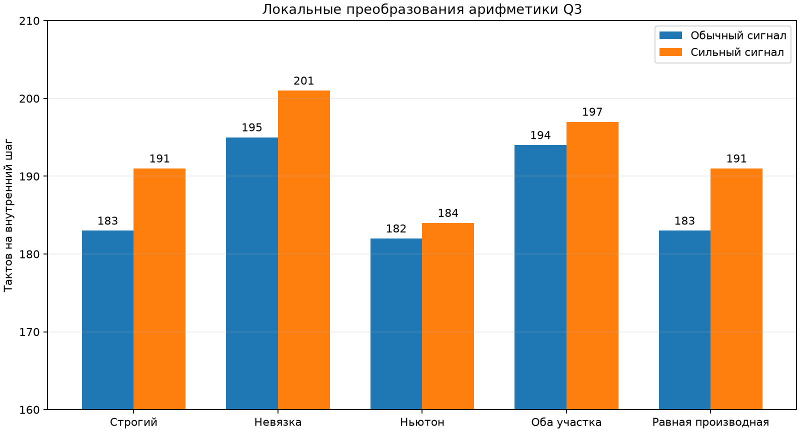

# Q3: локальная арифметика горячих участков

## Задача

Проверить, есть ли смысл писать невязку и шаг Ньютона вручную на ассемблере до
упрощения физической модели. Глобальное разрешение переставлять операции не
использовалось. Вместо него исходный код явно запрашивает аппаратные слитные
умножения со сложением только в выбранном участке.

Измеритель охватывает целиком блок из 768 внутренних шагов. Каждый результат
усреднён по 16 повторам; прерывания на время блока выключены.

| Вариант | Обычный сигнал, тактов/шаг | Сильный сигнал, тактов/шаг | Изменение конечного состояния |
|---|---:|---:|---:|
| Строгий исходный | 183 | 191 | 0 |
| Только невязка | 195 | 201 | до 3 младших разрядов |
| Только Ньютон | **182** | **184** | 0 на двух потоках |
| Невязка и Ньютон | 194 | 197 | до 3 младших разрядов |
| Только повтор равной производной | 183 | 191 | 0 |

## Что произошло

Явная цепочка слитных операций в невязке уменьшила машинный код, но создала
длинную последовательную зависимость. Ядро не смогло перекрывать задержки
соседними независимыми умножениями, поэтому вариант стал медленнее на 10–12
тактов. Переносить невязку на ассемблер в таком виде бессмысленно.

Локальная запись шага Ньютона через слитные операции уменьшила участок
`run_incremental_block_stream` с 2484 до 2464 байт и дала 1 такт на обычном и
7 тактов на сильном потоке. Три повторных запуска дали 182/184 такта. Конечные
три переменные схемы на обоих потоках совпали с исходным вариантом побитно.

Отдельная попытка один раз вычислить две равные производные ничего не изменила:
GCC 12 уже сам устраняет повторное умножение.

## Вывод

В компиляторе нет провала, который ручной ассемблер исправит в несколько раз.
Лучшее локальное преобразование экономит 1–7 тактов, то есть около 0,5–3,7%.
Это полезный последний штрих, но не новый главный путь оптимизации. Вариант
оставлен отдельной сборкой `q3_local_newton`, пока его не проверим на более
длинном наборе сигналов; основная строгая сборка не изменена.
