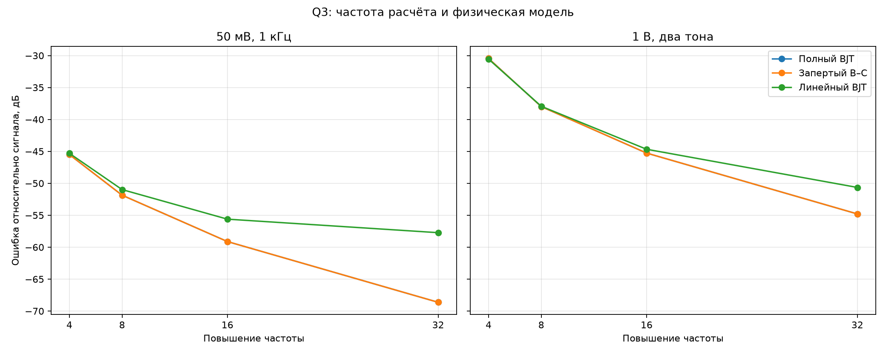
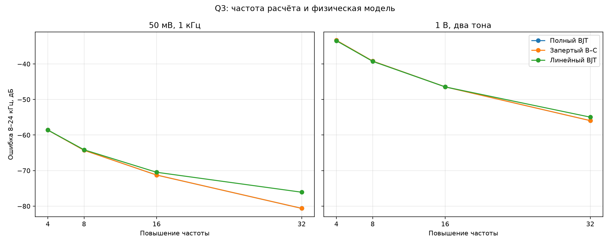
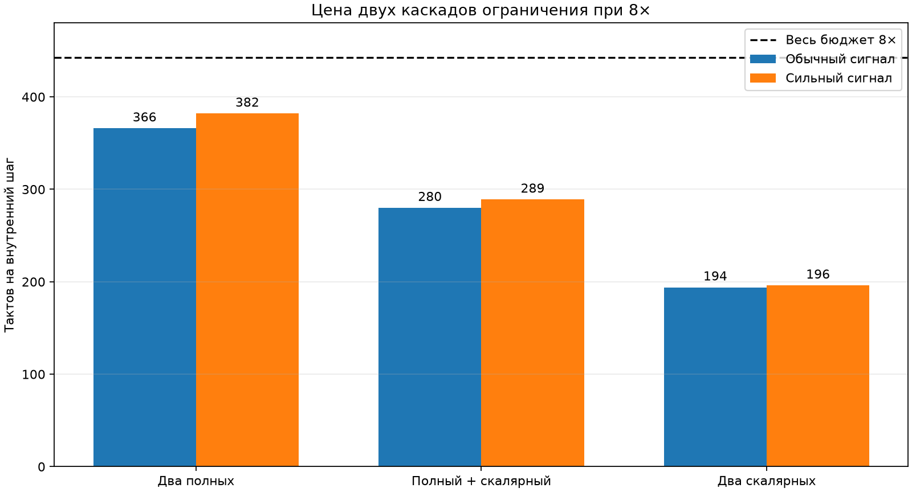

# Q3: выбор физики и частоты расчёта

## Постановка

Эталон — полная модель Эберса—Молла с полной сходимостью Ньютона при 64×.
Кандидаты работают с одной поправкой на внутренний отсчёт при 4×, 8×, 16× и
32×. Выходы сравниваются в общих точках сетки 48 кГц после 4 мс установления.

Проверены три уровня физики:

- **полный BJT** — обе экспоненты транзистора и диодная пара;
- **запертый B–C** — обратный переход заменён током `-I_S` с нулевой
  производной; это соответствует уже используемому быстрому ядру STM32;
- **линейный BJT** — оба перехода транзистора линеаризованы около рабочей
  точки, нелинейной остаётся только диодная пара. После переноса линейной части
  в постоянную матрицу система сводится к одному скалярному уравнению.

Отрицательная относительная ошибка показывает, на сколько децибел ошибка ниже
полезного выходного сигнала. Последний столбец считает только ошибку в полосе
8–24 кГц и лучше обнаруживает спектральные продукты наложения.

| Сигнал | Физика | Частота | Макс. ошибка, мкВ | СКО, мкВ | Относительная, дБ | Ошибка 8–24 кГц, дБ | Вклад упрощения, СКО мкВ |
|---|---|---:|---:|---:|---:|---:|---:|
| 50 мВ, 1 кГц | Полный BJT | 4× | 3253.8 | 1522.5 | -45.5 | -58.6 | 0.0 |
| 50 мВ, 1 кГц | Полный BJT | 8× | 1529.8 | 732.2 | -51.9 | -64.3 | 0.0 |
| 50 мВ, 1 кГц | Полный BJT | 16× | 655.7 | 317.4 | -59.1 | -71.2 | 0.0 |
| 50 мВ, 1 кГц | Полный BJT | 32× | 218.5 | 106.2 | -68.6 | -80.6 | 0.0 |
| 50 мВ, 1 кГц | Запертый B–C | 4× | 3253.8 | 1522.5 | -45.5 | -58.6 | 0.0 |
| 50 мВ, 1 кГц | Запертый B–C | 8× | 1529.8 | 732.2 | -51.9 | -64.3 | 0.0 |
| 50 мВ, 1 кГц | Запертый B–C | 16× | 655.7 | 317.4 | -59.1 | -71.2 | 0.0 |
| 50 мВ, 1 кГц | Запертый B–C | 32× | 218.5 | 106.2 | -68.6 | -80.6 | 0.0 |
| 50 мВ, 1 кГц | Линейный BJT | 4× | 3871.2 | 1557.1 | -45.3 | -58.6 | 301.0 |
| 50 мВ, 1 кГц | Линейный BJT | 8× | 2240.7 | 810.1 | -51.0 | -64.1 | 343.1 |
| 50 мВ, 1 кГц | Линейный BJT | 16× | 1441.0 | 475.3 | -55.6 | -70.5 | 357.2 |
| 50 мВ, 1 кГц | Линейный BJT | 32× | 1037.8 | 372.5 | -57.7 | -76.1 | 361.6 |
| 1 В, два тона | Полный BJT | 4× | 115193.7 | 13290.9 | -30.5 | -33.4 | 0.0 |
| 1 В, два тона | Полный BJT | 8× | 37165.1 | 5584.9 | -38.0 | -39.2 | 0.0 |
| 1 В, два тона | Полный BJT | 16× | 15741.6 | 2416.2 | -45.3 | -46.4 | 0.0 |
| 1 В, два тона | Полный BJT | 32× | 5219.5 | 807.0 | -54.8 | -55.9 | 0.0 |
| 1 В, два тона | Запертый B–C | 4× | 115193.7 | 13290.9 | -30.5 | -33.4 | 0.0 |
| 1 В, два тона | Запертый B–C | 8× | 37165.1 | 5584.9 | -38.0 | -39.2 | 0.0 |
| 1 В, два тона | Запертый B–C | 16× | 15741.6 | 2416.2 | -45.3 | -46.4 | 0.0 |
| 1 В, два тона | Запертый B–C | 32× | 5219.5 | 807.0 | -54.8 | -55.9 | 0.0 |
| 1 В, два тона | Линейный BJT | 4× | 114106.6 | 13145.9 | -30.6 | -33.5 | 1417.7 |
| 1 В, два тона | Линейный BJT | 8× | 36341.0 | 5617.8 | -37.9 | -39.3 | 985.9 |
| 1 В, два тона | Линейный BJT | 16× | 17134.0 | 2588.6 | -44.7 | -46.5 | 1038.6 |
| 1 В, два тона | Линейный BJT | 32× | 7255.2 | 1300.9 | -50.6 | -55.0 | 1070.5 |

## Измерение на STM32G474RE

Скалярное диодное ядро реализовано с одной поправкой Ньютона, одним обращением
к CORDIC и тем же рекуррентным обновлением гиперболических функций. Блочный
замер 16 периодов по 768 шагов дал **97 тактов** на обычном и **98 тактов** на
сильном сигнале. Полный текущий Q3 требует 183/191 такт. Ускорение составляет
1,89–1,95 раза; аварийных полных пересчётов не было.
Отдельная имитация арифметики `float32` и округления CORDIC дала конечные слова
`3189244338` и `1038296515`; они побитно совпали с двумя результатами платы.

| Состав двух каскадов при 8× | Обычный сигнал | Сильный сигнал | Остаток от 442,7 такта |
|---|---:|---:|---:|
| Два полных | 366 | 382 | 60,7–76,7 |
| Полный + скалярный | 280 | 289 | 153,7–162,7 |
| Два скалярных | 194 | 196 | 246,7–248,7 |

## Выбор

Рабочая исходная точка — **8×**. При 4× сильный двухтональный сигнал имеет лишь
около -30,5 дБ относительной точности и слишком большую невязку после одной
поправки. Переход 8× → 16× улучшает точность примерно на 7 дБ, но два даже
скалярных каскада съедают 194–196 тактов из всего бюджета 221,4 такта и не
оставляют места остальной педали.

На первом проходе разумно оставить **первый каскад полным, второй сделать
скалярным**. Такой вариант сохраняет одну транзисторную нелинейность и оставляет
154–163 такта на входной каскад, темброблок, выход, повышение/понижение частоты
и передачу звука. После сборки всей цепи его надо напрямую сравнить с двумя
полными каскадами; если транзисторная нелинейность второго каскада слышимо не
влияет, можно перейти к двум скалярным и получить ещё около 90 тактов запаса.
