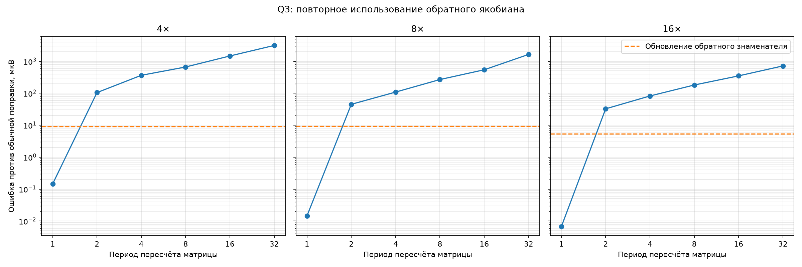
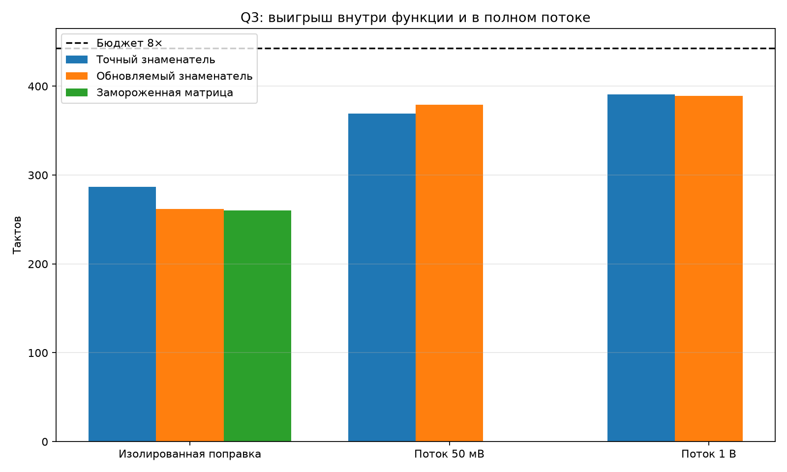

# Q3: повторное использование обратного якобиана

## Идея

Проверены два продолжения метода малого приращения:

1. `frozen` — обратная матрица поправки сохраняется на несколько отсчётов;
2. `reciprocal` — элементы якобиана считаются каждый шаг, но обратный
   определитель обновляется одной ньютоновской поправкой

\[
r_{k+1}=r_k(2-D_{k+1}r_k),\qquad r\approx D^{-1}.
\]

Оба варианта используют одну поправку состояния на внутренний отсчёт.

## Синус 1 кГц, 50 мВ, 5 мс

| Частота | Режим | Период матрицы | Против обычной поправки, мкВ | Против полной сходимости, мкВ | Макс. невязка, А | Пересчётов матрицы |
|---:|---|---:|---:|---:|---:|---:|
| 4× | замороженная матрица | 1 | 0.145 | 509.132 | 2.247e-06 | 961 |
| 4× | замороженная матрица | 2 | 104.714 | 510.132 | 2.221e-06 | 672 |
| 4× | замороженная матрица | 4 | 364.161 | 518.961 | 2.620e-06 | 529 |
| 4× | замороженная матрица | 8 | 662.592 | 703.429 | 4.679e-06 | 453 |
| 4× | замороженная матрица | 16 | 1467.175 | 1508.013 | 9.029e-06 | 425 |
| 4× | замороженная матрица | 32 | 3131.808 | 3187.762 | 1.531e-05 | 394 |
| 4× | обратный знаменатель | 32 | 9.170 | 509.113 | 2.249e-06 | 404 |
| 8× | замороженная матрица | 1 | 0.015 | 107.792 | 4.337e-07 | 1921 |
| 8× | замороженная матрица | 2 | 45.024 | 133.899 | 1.059e-06 | 1210 |
| 8× | замороженная матрица | 4 | 108.735 | 168.038 | 1.648e-06 | 852 |
| 8× | замороженная матрица | 8 | 268.374 | 284.861 | 2.226e-06 | 676 |
| 8× | замороженная матрица | 16 | 542.650 | 556.379 | 2.467e-06 | 585 |
| 8× | замороженная матрица | 32 | 1639.329 | 1657.447 | 5.466e-06 | 535 |
| 8× | обратный знаменатель | 32 | 9.225 | 107.660 | 4.343e-07 | 537 |
| 16× | замороженная матрица | 1 | 0.007 | 31.731 | 1.302e-07 | 3841 |
| 16× | замороженная матрица | 2 | 32.533 | 59.529 | 2.448e-07 | 1921 |
| 16× | замороженная матрица | 4 | 82.141 | 111.148 | 4.851e-07 | 961 |
| 16× | замороженная матрица | 8 | 181.089 | 207.952 | 9.562e-07 | 481 |
| 16× | замороженная матрица | 16 | 349.249 | 373.884 | 1.569e-06 | 241 |
| 16× | замороженная матрица | 32 | 716.087 | 729.497 | 2.429e-06 | 121 |
| 16× | обратный знаменатель | 32 | 5.419 | 31.736 | 1.302e-07 | 121 |

## Сильный вход

| Вход, В | Частота | Режим | Период | Ошибка, мкВ | Восстановлений нелинейности | Макс. приращение |
|---:|---:|---|---:|---:|---:|---:|
| 0.5 | 4× | замороженная матрица | 4 | 987.727 | 38 | 4.4695 |
| 0.5 | 4× | замороженная матрица | 8 | 1875.086 | 38 | 4.4694 |
| 0.5 | 4× | обратный знаменатель | 32 | 87.267 | 38 | 4.4694 |
| 0.5 | 8× | замороженная матрица | 4 | 229.559 | 50 | 2.2164 |
| 0.5 | 8× | замороженная матрица | 8 | 625.207 | 50 | 2.2162 |
| 0.5 | 8× | обратный знаменатель | 32 | 22.604 | 50 | 2.2165 |
| 1.0 | 4× | замороженная матрица | 4 | 2726.078 | 34 | 6.9678 |
| 1.0 | 4× | замороженная матрица | 8 | 6357.537 | 34 | 6.9683 |
| 1.0 | 4× | обратный знаменатель | 32 | 176.827 | 34 | 6.9675 |
| 1.0 | 8× | замороженная матрица | 4 | 709.176 | 48 | 3.3911 |
| 1.0 | 8× | замороженная матрица | 8 | 1481.406 | 48 | 3.3908 |
| 1.0 | 8× | обратный знаменатель | 32 | 51.532 | 48 | 3.3914 |

## Такты STM32G474RE

| Вариант | Изолированная поправка | Поток 50 мВ | Поток 1 В |
|---|---:|---:|---:|
| Точный знаменатель | 287 | 369 | 391 |
| Обновляемый обратный знаменатель | 262 | 379 | 389 |
| Замороженная обратная матрица | 260 | — | — |

Точное восстановление обратного знаменателя стоит 55 тактов, всей обратной
матрицы — 80 тактов. Одиночные результаты всех трёх вариантов побитно совпали.

## Вывод

Обновление обратного знаменателя численно удачно: при обычном входе оно добавляет
лишь 5–9 мкВ ошибки. Изолированная поправка ускорилась на 25 тактов. Однако в
полном потоке проверки и восстановление дополнительного состояния съели выигрыш:
обычный режим стал на 10 тактов дороже, а сильный — только на 2 такта дешевле.

Замороженная матрица требует восстановления за 80 тактов. Даже при периоде 4
её расчётная цена около 280 тактов до потокового управления, а ошибка уже
82–364 мкВ в зависимости от частоты. Поэтому ни один вариант пока не заменяет
точный знаменатель в основном пути.
