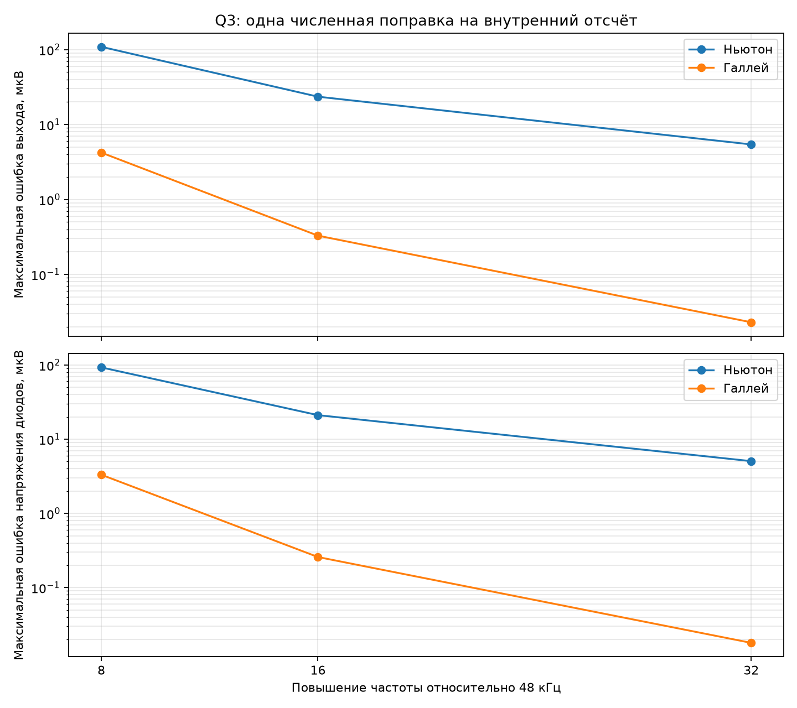
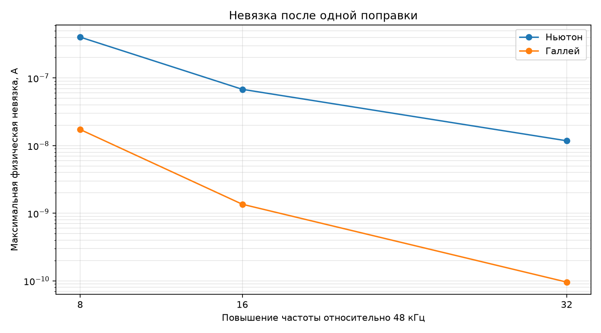
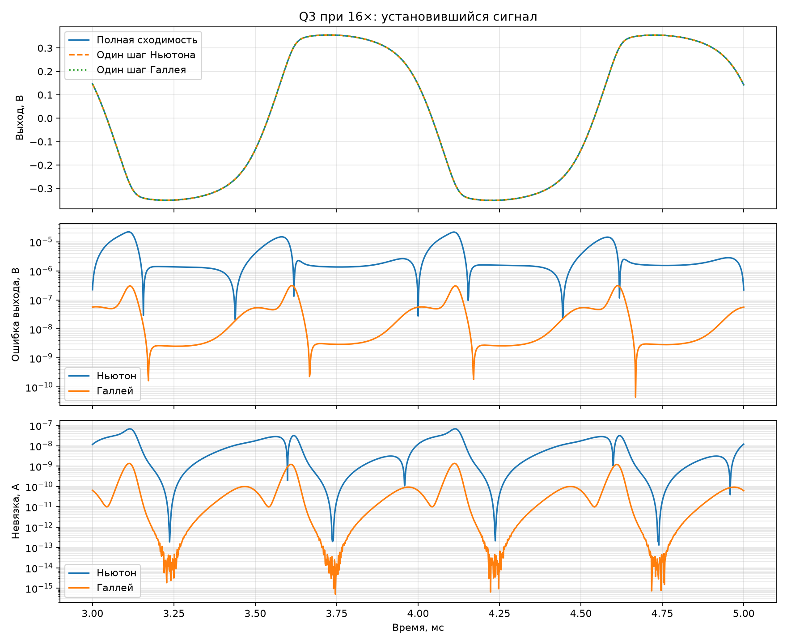

# Сокращение Q3 и одна численная поправка

## Цель

Без приближений исключить линейные узлы каскада Q3, определить размер
оставшейся нелинейной системы и сравнить одну поправку Ньютона и Галлея при
8×, 16× и 32× относительно 48 кГц.

## Сокращённая система

Полные узловые уравнения представлены как

\[
\mathbf L\mathbf v-\mathbf r+\mathbf P\boldsymbol\varphi(\mathbf Q\mathbf v)=0.
\]

После исключения шести узлов остаются три нелинейных напряжения
\(\mathbf q=(v_{BE},v_{BC},v_D)^T\):

\[
\mathbf g(\mathbf q)=\mathbf q-\mathbf a+
\mathbf H\boldsymbol\varphi(\mathbf q)=0,
\quad
\mathbf H=\mathbf Q\mathbf L^{-1}\mathbf P.
\]

При 16× матрица \(\mathbf H\) имеет ранг **3** и определитель
**2.480522e+06**. Следовательно, линейной зависимости, позволяющей
точно превратить систему в одно или два уравнения, нет. Дальнейшее сокращение
потребует уже физического приближения либо вложенного нелинейного решения.

Сокращённая модель с полной сходимостью сравнена с исходным шестимерным
решателем на 1 мс при шаге 0,5 мкс. Максимальная разница всех узлов —
**1.608e-07 В**, максимальная физическая невязка сокращённого
решения — **1.369e-13 А**. Разница ограничена прежде всего
более мягким порогом остановки исходного решателя.

## Одна поправка на отсчёт

Сигнал — синус 1 кГц с амплитудой 50 мВ, длительность 5 мс. Эталон для каждой
частоты — та же сокращённая модель с полной сходимостью. Поэтому таблица
измеряет ошибку неполного нелинейного решения, а не ошибку дискретизации по
времени.

| Метод | Частота | Макс. ошибка выхода, мкВ | СКО выхода, мкВ | Макс. ошибка диодов, мкВ | Макс. невязка, А | Решений 3×3 |
|---|---:|---:|---:|---:|---:|---:|
| Ньютон | 8× | 108.765 | 26.210 | 92.581 | 4.024e-07 | 1 |
| Галлей | 8× | 4.219 | 0.974 | 3.314 | 1.730e-08 | 2 |
| Ньютон | 16× | 23.502 | 6.376 | 21.054 | 6.799e-08 | 1 |
| Галлей | 16× | 0.329 | 0.074 | 0.258 | 1.356e-09 | 2 |
| Ньютон | 32× | 5.422 | 1.630 | 5.053 | 1.179e-08 | 1 |
| Галлей | 32× | 0.023 | 0.005 | 0.018 | 9.579e-11 | 2 |

## Вывод

При 16× один многомерный шаг Галлея даёт максимальную ошибку выхода
**0.329 мкВ**, а один шаг Ньютона при
32× — **5.422 мкВ**. В этом опыте
вариант `16× + Галлей` точнее примерно в **16.5 раза**.

Но это ещё не означает меньшую стоимость на STM32. Многомерной формуле Галлея
нужны одна оценка нелинейностей и два решения системы 3×3; Ньютону — та же
оценка и одно решение 3×3. Преимущество дешёвой второй производной полностью
реализовалось бы в скалярном уравнении, но точное сокращение Q3 скалярного
уравнения не дало.

## Следующий шаг

Проверить последовательные физические упрощения транзистора: сначала убрать
обратный ток перехода база–коллектор, затем сравнить упрощённую модель с полной
по сигналу, спектру и переходам. Параллельно нужно измерить на STM32 стоимость
одного и двух решений системы 3×3; без измерения тактов выбирать Ньютон или
Галлей рано.
