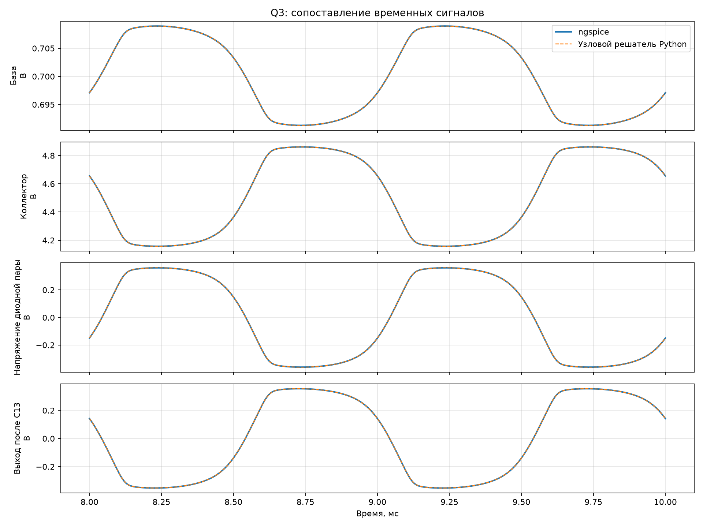
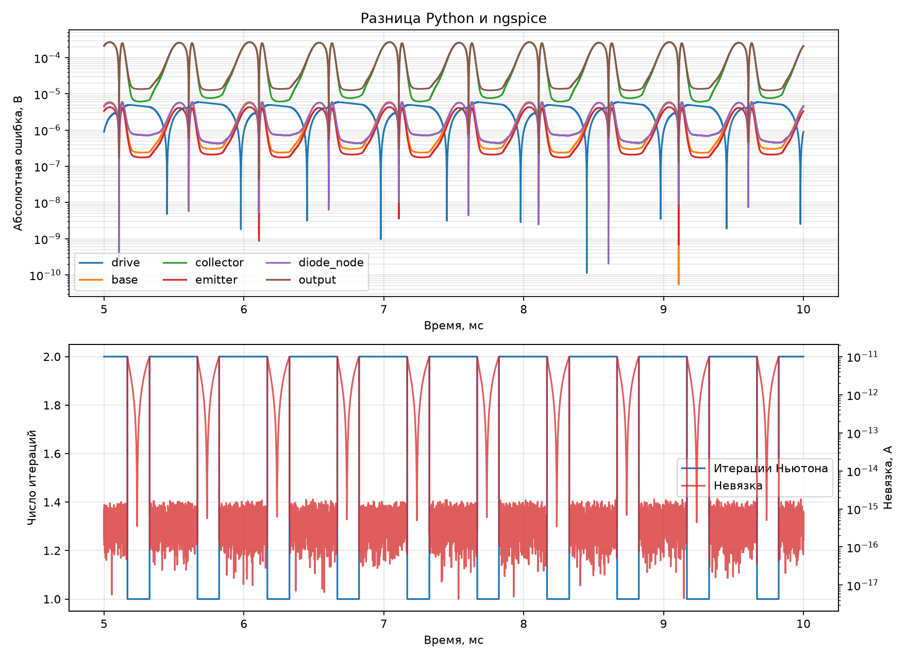
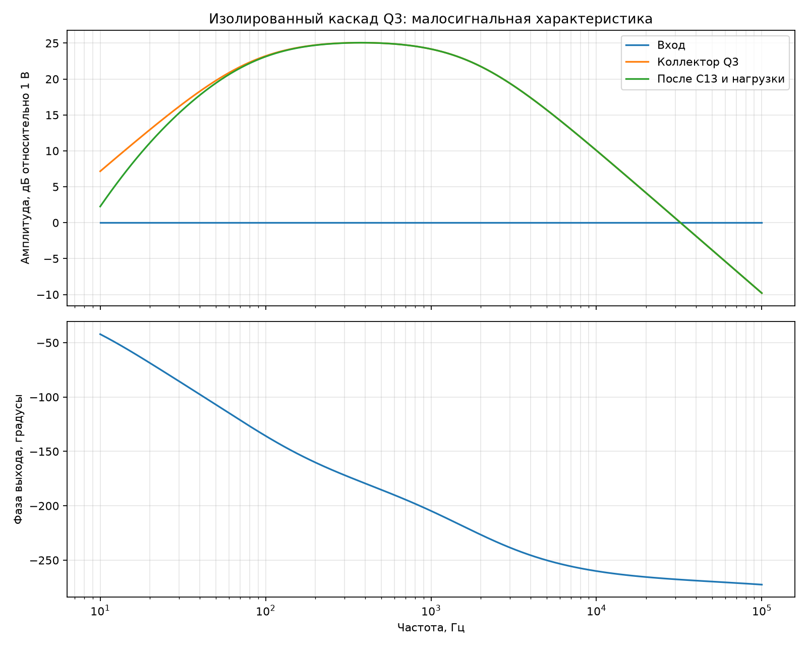

# Полная узловая модель каскада Q3

## Цель

Проверить независимый узловой решатель Python сравнением с ngspice. Оба
решателя используют одинаковые явно записанные уравнения Эберса—Молла и
встречно-параллельной диодной пары, но имеют независимые реализации матрицы,
якобиана и интегрирования.

## Состав каскада

- C5 = 100 нФ и R19 = 10 кОм на входе;
- R20 = 100 кОм;
- R18 = 10 кОм;
- R21 = 150 Ом;
- R17 = 470 кОм и C12 = 470 пФ в обратной связи;
- C6 = 1 мкФ и точная гиперболическая диодная пара;
- C13 = 100 нФ и линейный эквивалент нагрузки 110 кОм.

Вход переходного расчёта: синус 1 кГц, амплитуда 50 мВ. Шаг решателя Python —
0,5 мкс, метод — обратный Эйлер, на каждом шаге выполняется полная сходимость
Ньютона с аналитическим якобианом и поиском длины шага.

## Рабочая точка

| Узел | ngspice, В | Python, В | Разница, В |
|---|---:|---:|---:|
| `drive` | 0.700245300 | 0.700245349 | 4.939e-08 |
| `base` | 0.700245300 | 0.700245349 | 4.939e-08 |
| `collector` | 4.509508000 | 4.509508131 | 1.311e-07 |
| `emitter` | 0.066307010 | 0.066307010 | 9.153e-12 |
| `diode_node` | 4.509508000 | 4.509508131 | 1.311e-07 |
| `output` | 0.000000000 | 0.000000000 | 0.000e+00 |

## Переходный расчёт

| Узел | Максимальная ошибка, В | СКО ошибки, В |
|---|---:|---:|
| `drive` | 5.965e-06 | 3.616e-06 |
| `base` | 5.991e-06 | 3.457e-06 |
| `collector` | 2.718e-04 | 1.549e-04 |
| `emitter` | 4.312e-06 | 2.485e-06 |
| `diode_node` | 5.990e-06 | 3.509e-06 |
| `output` | 2.694e-04 | 1.570e-04 |

Максимальное число итераций Ньютона после 5 мс:
**2**.

Максимальная невязка Python после 5 мс:
**9.995e-12 А**.

## Частотная характеристика ngspice

## Ограничения опыта

- нагрузка следующего транзистора заменена линейными R12 + R16 = 110 кОм;
- паразитные ёмкости, сопротивления выводов и эффект Эрли не включены;
- ngspice применяет внутренний адаптивный шаг Gear первого порядка, Python —
  постоянный шаг обратного Эйлера; поэтому временные решения не обязаны
  совпадать до машинной точности;
- параметры полупроводников пока исследовательские, а не измеренные.

## Следующий шаг

Линейные узлы уже исключены: результат и сравнение одной поправки Ньютона и
Галлея приведены в [следующем опыте](../q3_reduction/report.md).
