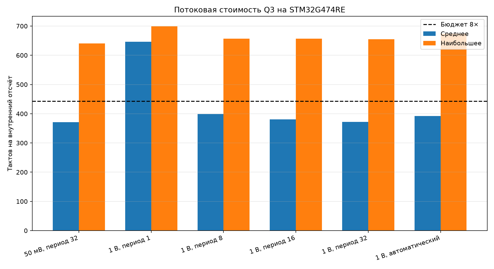
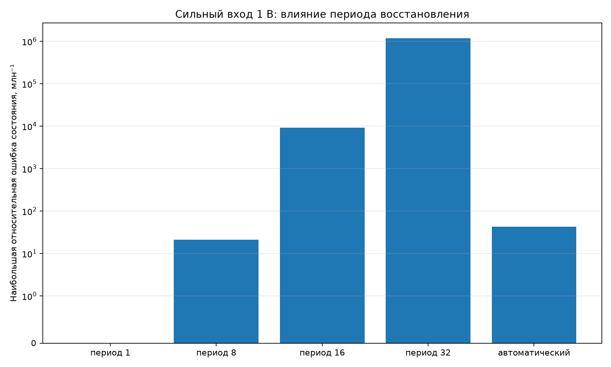

# Q3: длительный поток на STM32G474RE

## Постановка

Из полной модели сформированы периодические последовательности линейной части
Q3 при 16×, синусе 1 кГц и входах 50 мВ и 1 В. Перед записью последовательности
схема прошла 30 периодов установления. Каждый период из 768 внутренних отсчётов
повторён на плате 1000 раз: по **768 000 поправок**, что соответствует одной
секунде внутреннего потока.

В измеряемый участок входят поправка Ньютона, проверка диапазона, выбор периода
и полное восстановление состояния. Контрольный абсолютный пересчёт для оценки
ошибки выполняется после измеряемого участка.

## Результаты

| Режим | Среднее, тактов | Наибольшее, тактов | Ошибка состояния | Восстановлений | Выходов за диапазон | Нечисловых результатов |
|---|---:|---:|---:|---:|---:|---:|
| 50 мВ, период 32 | 371 | 641 | 6.4553e-05 | 24000 | 0 | 0 |
| 1 В, период 1 | 646 | 699 | 0 | 768000 | 0 | 0 |
| 1 В, период 8 | 399 | 657 | 2.1231e-05 | 96000 | 0 | 0 |
| 1 В, период 16 | 381 | 657 | 0.00931305 | 48000 | 0 | 0 |
| 1 В, период 32 | 372 | 655 | 1.19271 | 24000 | 0 | 0 |
| 1 В, автоматический | 392 | 674 | 4.2715e-05 | 36000 | 0 | 0 |

## Автоматический период

Если модуль безразмерной поправки транзистора или диодов превышает 0,25,
на следующие 32 шага включается восстановление раз в 8 шагов. В остальное
время используется период 32. На сильном входе это дало 36 000 восстановлений
вместо 96 000 у постоянного периода 8, при ошибке состояния
4.2715e-05.

## Временной бюджет

- бюджет 8×: 442.7 такта;
- бюджет 16×: 221.4 такта;
- обычный вход: 371 такт, 83.8% бюджета 8×;
- сильный вход с автоматическим периодом: 392 такта,
  88.5% бюджета 8×.

Среднее одного Q3 помещается в 8×, но не в 16×. Отдельные шаги восстановления
дороже бюджета одного внутреннего отсчёта; при обработке звукового блока это
допустимо только за счёт более дешёвых соседних шагов. Два каскада по-прежнему
не помещаются в общий бюджет 8×.

## Вывод

Поток подтвердил устойчивость малого приращения на обычном входе и показал,
что одной проверки диапазона CORDIC недостаточно для сильного сигнала.
Постоянный период 32 при 1 В непригоден. Автоматическое переключение удерживает
ошибку около 42.7
миллионных долей без нечисловых результатов и выходов за диапазон.
