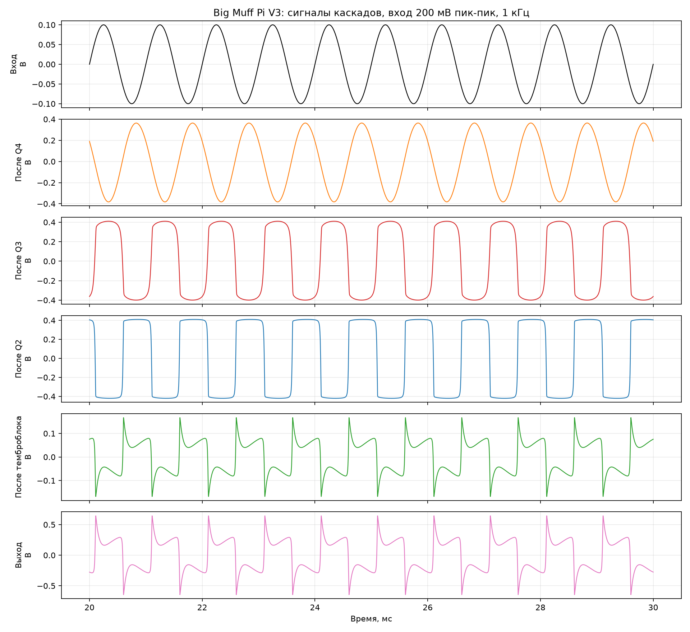
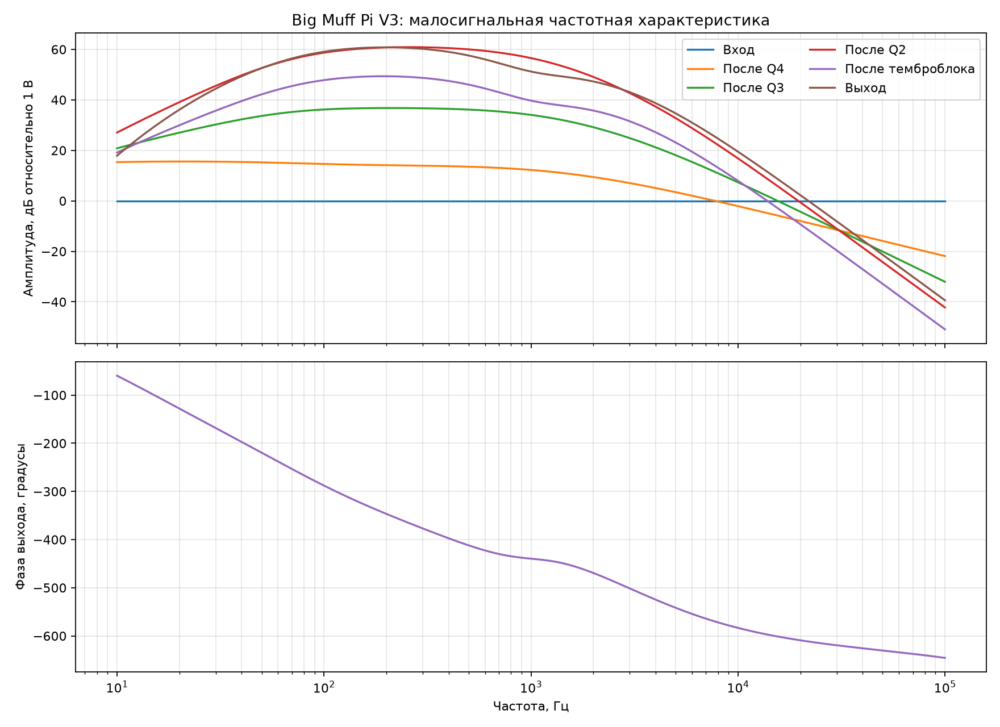

# Исходный расчёт эталонной схемы

## Назначение

Первый воспроизводимый расчёт полной топологии Big Muff Pi V3 в ngspice.
Он служит эталоном связности схемы и начальной точкой для будущей физической
модели STM32.

Это ещё не окончательный звуковой эталон: модели BC239 и 1N914 предварительные
и должны быть уточнены по надёжному источнику или измерениям.

## Условия

- питание: 9 В;
- температура: 27 °C;
- Sustain: 1,0;
- Tone: 0,5;
- Volume: 1,0;
- вход переходного расчёта: синус 1 кГц, 200 мВ пик-пик;
- нагрузка выхода: 1 МОм;
- частотный расчёт: 10 Гц — 100 кГц.

## Рабочие точки

| Каскад | База | Эмиттер | Коллектор |
|---|---:|---:|---:|
| Q4 | 0,622 В | 0,0156 В | 7,303 В |
| Q3 | 0,691 В | 0,0598 В | 4,946 В |
| Q2 | 0,686 В | 0,0564 В | 4,871 В |
| Q1 | 1,565 В | 0,942 В | 4,743 В |

Рабочие точки качественно согласуются со статьёй: Q4 смещён примерно к 7 В,
а остальные коллекторы находятся около середины питания. Отличия Q3/Q2 от
указанных в статье 4,4 В ожидаемы из-за предварительной модели BC239.

## Переходный расчёт

| Узел | Размах пик-пик |
|---|---:|
| Вход | 0,200 В |
| После Q4 | 0,747 В |
| После Q3 | 0,810 В |
| После Q2 | 0,830 В |
| После темброблока | 0,335 В |
| Выход | 1,290 В |

На Q3 появляется мягкое ограничение, Q2 формирует почти прямоугольный сигнал,
темброблок подавляет основную амплитуду и подчёркивает переходы, Q1 возвращает
уровень. Это соответствует описанной в статье последовательности.

## Частотный расчёт

Максимумы совокупной малосигнальной характеристики:

- после Q4: 15,60 дБ около 20,9 Гц;
- после Q3: 36,77 дБ около 208,9 Гц;
- после Q2: 60,90 дБ около 257,0 Гц;
- после темброблока: 49,36 дБ около 195,0 Гц;
- выход: 60,81 дБ около 199,5 Гц.

Совокупные значения нельзя напрямую сравнивать с добавочным усилением каждого
каскада из статьи: график показывает напряжение каждого узла относительно
входного источника.

## Следующие проверки

- заменить предварительную модель BC239;
- заменить предварительную модель 1N914;
- добавить семейство частотных характеристик по положению Tone;
- добавить семейство переходных характеристик по Sustain;
- сравнить рабочие точки с измеренной педалью;
- выделить отдельный каскад Q3 для сопоставления с узловым решателем Python.
