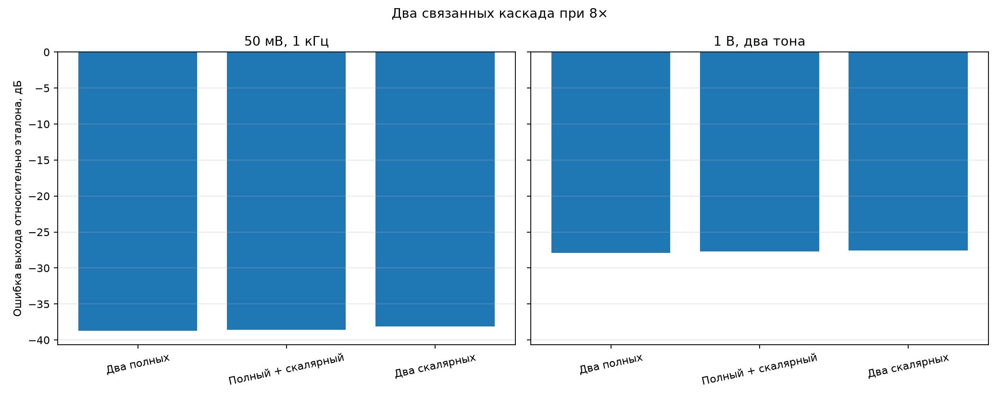
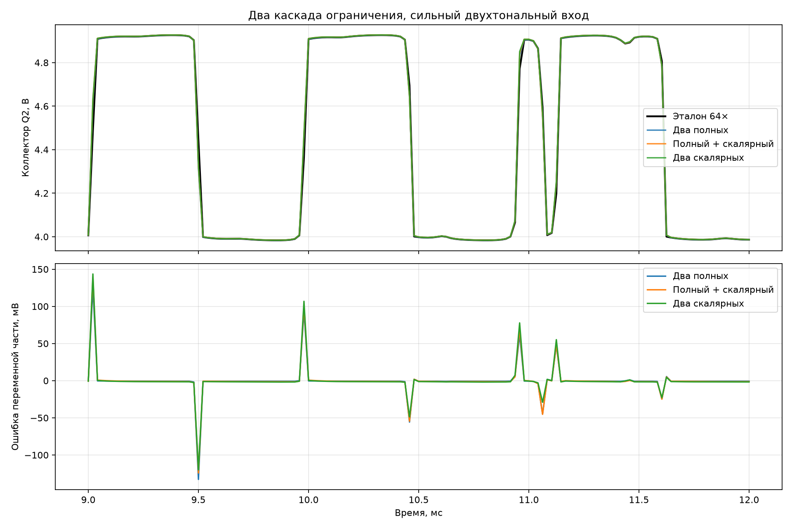

# Два связанных каскада ограничения

## Модель

Q3 и Q2 собраны в одну узловую систему. Разделительный C13 и R12 присутствуют
ровно один раз, поэтому первый каскад нагружен настоящим входом второго. После
Q2 включена линейная нагрузка двух ветвей темброблока: C9/R5, R8/C8 и полное
сопротивление регулятора 100 кОм. Сам выходной каскад пока не включён.

Эталон использует полную модель Эберса—Молла двух транзисторов, полную
сходимость Ньютона и частоту 64×. Три рабочих варианта используют одну поправку
на отсчёт при 8×. Ошибки считаются после удаления постоянной составляющей и
4 мс установления.

| Сигнал | Архитектура | СКО выхода, мВ | Макс. выхода, мВ | Вклад физического сокращения, мВ СКО | Относительная ошибка, дБ | Ошибка 8–24 кГц, дБ | Макс. невязка, В |
|---|---|---:|---:|---:|---:|---:|---:|
| 50 мВ, 1 кГц | Два полных | 4.86 | 21.24 | 0.00 | -38.7 | -42.9 | 4.44e-03 |
| 50 мВ, 1 кГц | Полный + скалярный | 4.93 | 22.62 | 0.49 | -38.6 | -42.8 | 4.42e-03 |
| 50 мВ, 1 кГц | Два скалярных | 5.22 | 28.47 | 1.88 | -38.1 | -42.4 | 4.44e-03 |
| 1 В, два тона | Два полных | 18.34 | 141.88 | 0.00 | -27.9 | -27.2 | 3.53e-01 |
| 1 В, два тона | Полный + скалярный | 18.80 | 140.03 | 1.69 | -27.7 | -27.1 | 3.87e-01 |
| 1 В, два тона | Два скалярных | 19.07 | 144.39 | 3.05 | -27.5 | -27.0 | 3.85e-01 |

## Вычислительная цена

| Архитектура | Обычный сигнал, тактов | Сильный сигнал, тактов | Остаток бюджета 8× |
|---|---:|---:|---:|
| Два полных | 366 | 382 | 60,7–76,7 |
| Полный + скалярный | 280 | 289 | 153,7–162,7 |
| Два скалярных | 194 | 196 | 246,7–248,7 |

## Вывод

Гибридный вариант подтверждён как основная архитектура. Линеаризация только
второго транзистора добавила 0,49 мВ СКО на слабом входе при общей ошибке
4,93 мВ и 1,69 мВ на предельном входе при общей ошибке 18,80 мВ. Относительная
ошибка ухудшилась лишь на 0,13–0,22 дБ, зато освободилось 93 такта на сильном
сигнале.

Два скалярных каскада тоже близки к эталону, но пока оставлены запасным
вариантом: вклад сокращения возрастает до 1,88–3,05 мВ. Следующая проверка —
добавить входной усилитель и настоящий регулятор Sustain, потому что именно они
зададут реальный размах сигнала на первом ограничителе. Предельный двухтональный
вход 1 В намеренно жёстче штатного режима и показывает, что численная ошибка
одной поправки при 8× сосредоточена на резких фронтах ограничения.
